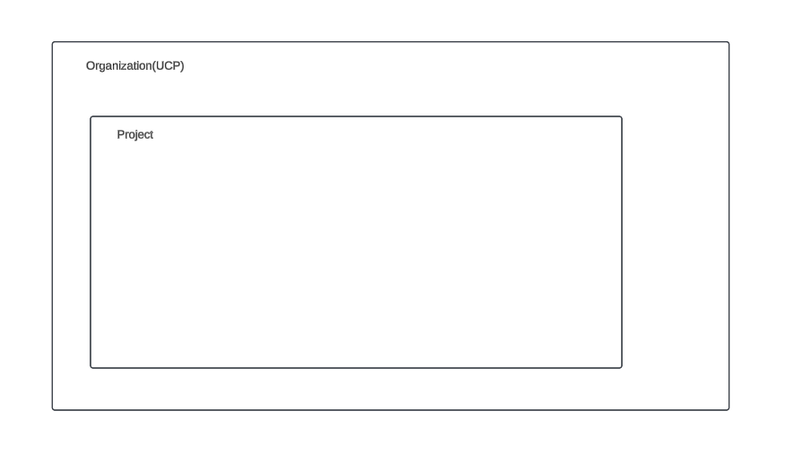
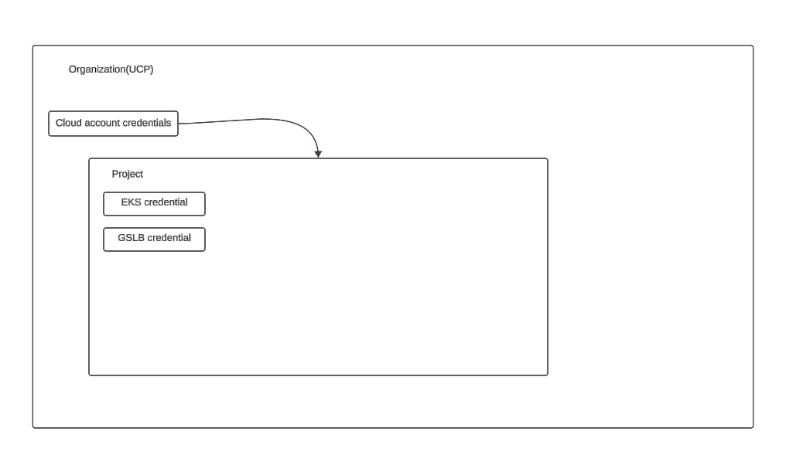
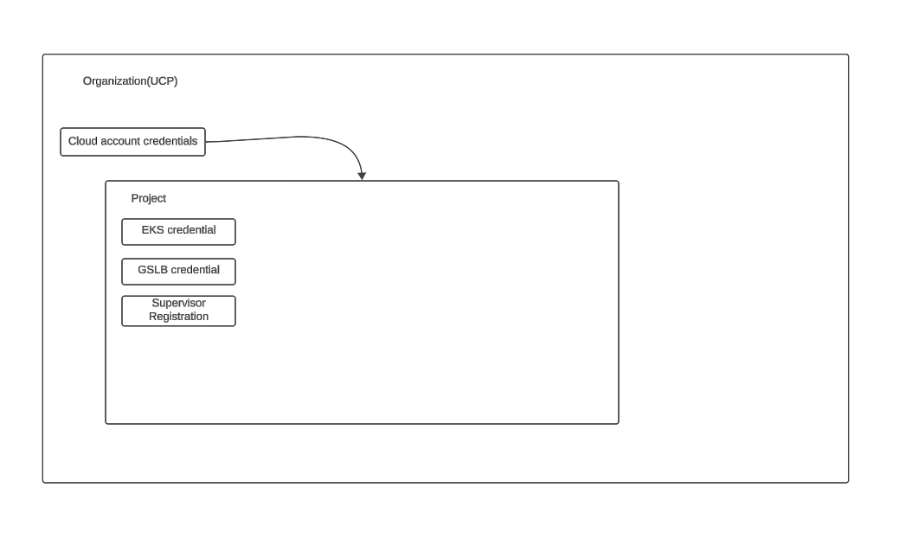
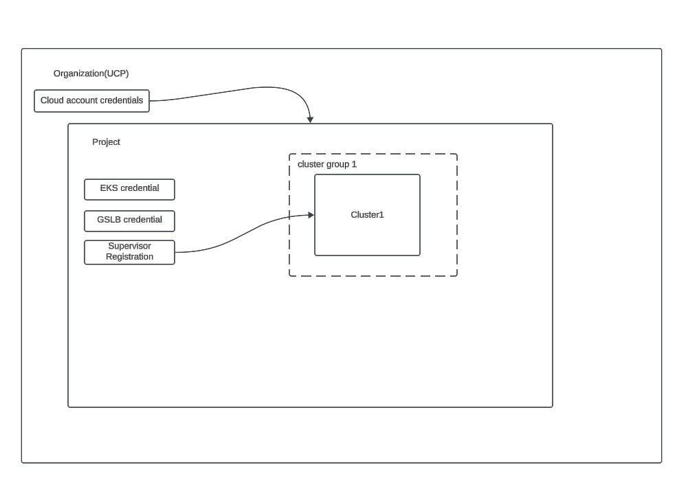
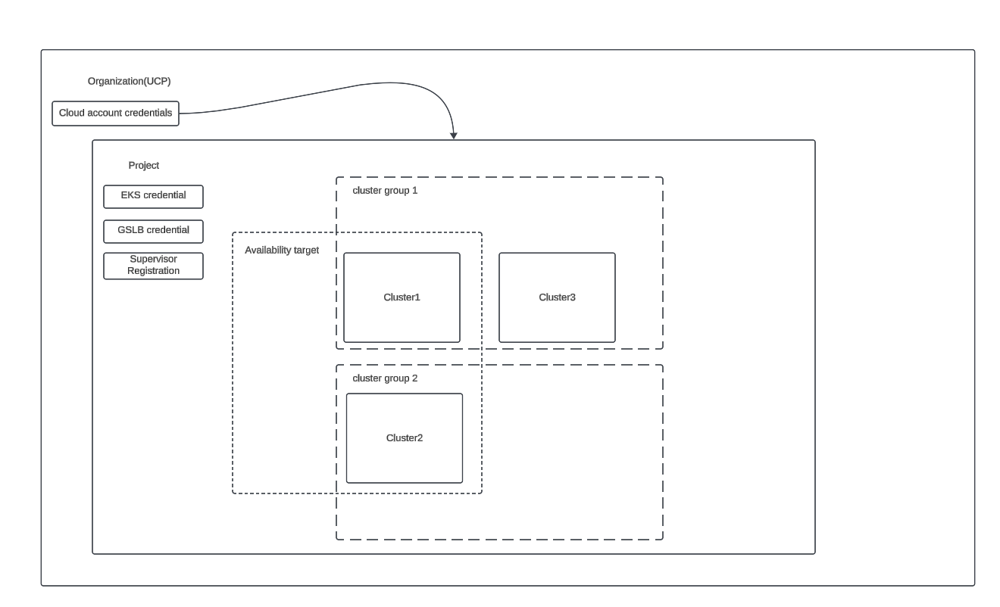
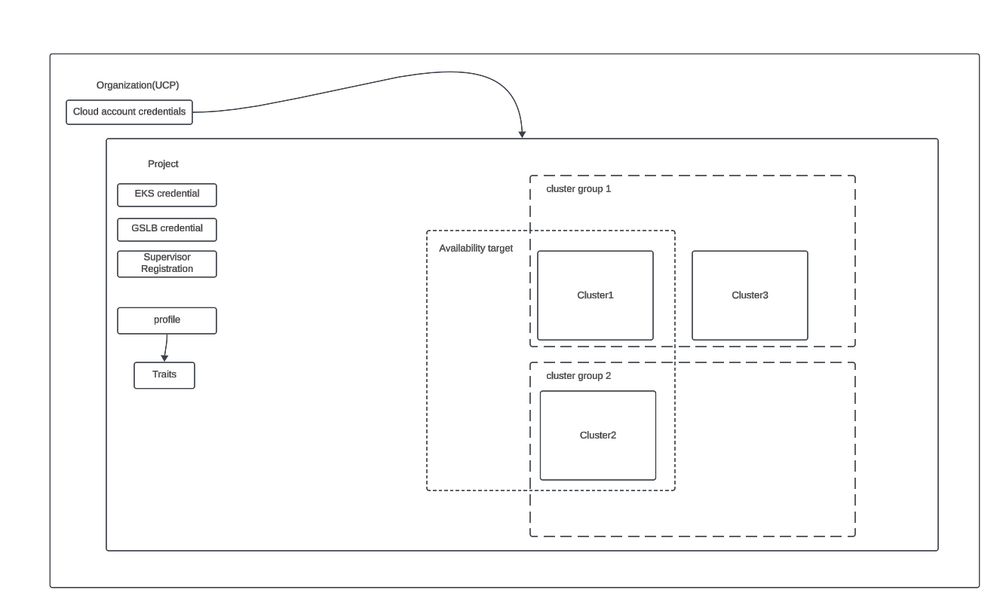
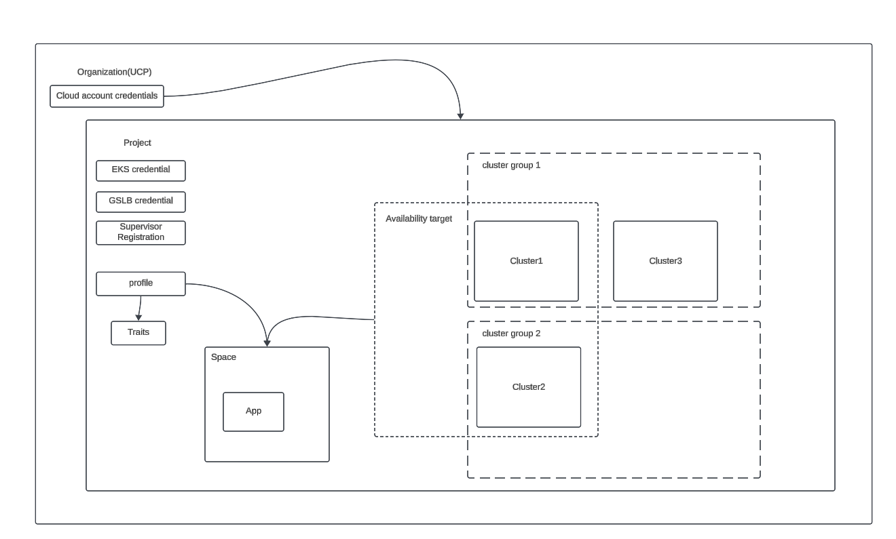

# Installing Tanzu Platform for Kubernetes by Will Arroyo

## Overview

In this section we will cover the initial setup and install of the platform. This will be done from a PE point of view. This portion of the workshop is not hands on and should be run in a demo fashion. It's purpose is to show an end to end setup prior to participants getting hands on and give them an overall understanding of the core concepts and components involved that they will use in the hand on lab. 

## Setup a Project

Walk through the creation of a project and assigning users and groups to this project. 

1. create a project
2. login to the csp console and give a user access to read only permissions at the org level
3. go to the project and give the user admin permissions at to the platform
4. walk through the different [levels of access](https://docs.vmware.com/en/VMware-Tanzu-Platform/services/create-manage-apps-tanzu-platform-k8s/how-to-adding-users.html#service-roles-1) and their use cases.
5. discuss [fine grained access](https://docs.vmware.com/en/VMware-Tanzu-Platform/services/create-manage-apps-tanzu-platform-k8s/how-to-granular-access-control.html) to clusters and spaces

[Docs for project](https://docs.vmware.com/en/VMware-Tanzu-Platform/services/create-manage-apps-tanzu-platform-k8s/getting-started-set-up-infra.html#create-a-project-5)

[Docs for configuring RBAC for projects](https://docs.vmware.com/en/VMware-Tanzu-Platform/services/create-manage-apps-tanzu-platform-k8s/how-to-adding-users.html)

## Create credentials

Walk through steps to add a cloud account and EKS/GSLB credentials. Most likely a cloud account will already be addded so we will just show where it was added and explain it.

1. create an [aws cloud account](https://docs.vmware.com/en/VMware-Tanzu-Platform/services/create-manage-apps-tanzu-platform-k8s/getting-started-set-up-infra.html#add-aws-account) in the project. 
2. [create EKS credentials](https://docs.vmware.com/en/VMware-Tanzu-Platform/services/create-manage-apps-tanzu-platform-k8s/getting-started-set-up-infra.html#create-eks-credentials-7), this can be done multiple times for an account jsut be sure to change the name.
3. [create GSLB credentials](https://docs.vmware.com/en/VMware-Tanzu-Platform/services/create-manage-apps-tanzu-platform-k8s/getting-started-set-up-infra.html#create-route-53-gslb-credentials-8). this can also be done multiple times per account just rename it when creating.
4. show how to add an existing account to another project. 

## Add a supervisor cluster

Walk through the steps to add a supervisor cluster. This will likely already be done so in that case just walk through the steps as if you were going to add a new one.

1. register a supervsior cluster in hub within the project. `Kubernetes Managmenet -> TKG regsitrations -> Register TKG Instance ` 
2. take the generate registration url and plug it into vsphere to register the supervisor. [official docs here](https://docs.vmware.com/en/VMware-vSphere/8.0/vsphere-with-tanzu-tkg/GUID-2BB4E587-AC71-4DBA-8DA5-9B497B4F4991.html).

   
## Create a cluster

This section will assume that the default run cluster group is being used. In the hands on it will walk through creating a cluster group with capabilties.

1. follow the UI steps to create a cluster in the run cluster group with basic labels. add a label `demo: true`  to the cluster when creating. [docs](https://docs.vmware.com/en/VMware-Tanzu-Platform/services/create-manage-apps-tanzu-platform-k8s/getting-started-set-up-infra.html#create-an-eks-cluster-in-the-run-cluster-group-11).

## Setup Availability targets

Create an availability target that matches the label created for the cluster in the previous step.

1. Create  a new availablity target where the label matches `demo: true`. [docs](https://docs.vmware.com/en/VMware-Tanzu-Platform/services/create-manage-apps-tanzu-platform-k8s/how-to-manage-availability-targets.html)

## Create a profile

[Create a custom networking profile.](https://docs.vmware.com/en/VMware-Tanzu-Platform/services/create-manage-apps-tanzu-platform-k8s/getting-started-create-app-envmt.html#create-custom-networking-profile-2)

1. create the profile
2. select the networking traits
3. update the values for the ingress trait

## Create a space

Create a space that uses the availability target and some pre-existing profiles along with the custom networking profile..

1. [create a space](https://docs.vmware.com/en/VMware-Tanzu-Platform/services/create-manage-apps-tanzu-platform-k8s/getting-started-create-app-envmt.html#create-a-space-in-your-project-4) 
2. select the spring dev profile and the custom networking profile. 

