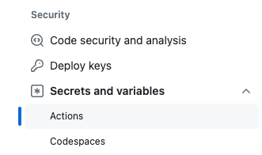
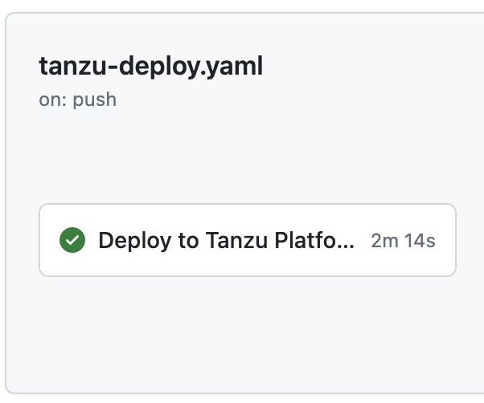

# Using CI Pipelines with Tanzu Platform for Kubernetes

Tanzu Platform integrates easily into your existing CI systems, enabling continuous deployment to your development environments. Let's walk through an example of onboarding an app to Tanzu Platform for Kubernetes with Github Workflows.

### Select an app

Fork the repo at https://github.com/cpage-pivotal/workshop-spring-sensors. We will use this sample app initially, but you can also apply this process to your own app!

### Get a Tanzu API Token

[Follow these instructions](https://github.com/cpage-pivotal/tanzu-deploy-action/blob/main/tanzu-api-token.md) to generate an auth token for your CI

Go to your forked source repo in Github. Click on Settings, and select Secrets and Variables / Actions



Using the "New Repository Secret" button, generate a secret with the following name:

* **TanzuApiToken**: The API Token that you generated in the Prerequisites<br>

### Prepare your app for Tanzu Platform

Clone the forked repo to your local machine. This repo currently has only application source code.

Change directories to the root folder of your repo, and run `tanzu app init`. Accept the defaults, including `buildpacks` for the build type. This will create the `ContainerApp` configuration in the `.tanzu/config` subfolders.

### Create the Pipeline

In the root of your source code repo, create the workflow file `.github/workflows/tanzu-deploy.yaml`. Copy the contents of the [Sample Workflow](https://raw.githubusercontent.com/cpage-pivotal/tanzu-deploy-action/main/sample-workflow.yaml) into this file.

Replace the fields marked `<<ENTER VALUE>>` with your own values:
* `container_registry:` Complete the registry name by appending the image name for your app (e.g. `ghcr.io/${{ github.actor }}/my-app`)
* `project:` Enter the name of the Tanzu Platform project where you will be publishing ([Docs](https://docs.vmware.com/en/VMware-Tanzu-Platform/services/create-manage-apps-tanzu-platform-k8s/getting-started-set-up-infra.html#create-project))
* `space:` Enter the name of the Tanzu Platform space where you will be publishing ([Docs](https://docs.vmware.com/en/VMware-Tanzu-Platform/services/create-manage-apps-tanzu-platform-k8s/getting-started-create-app-envmt.html#create-a-space-in-your-project))

**Optional:** Uncomment the line where `buildPlanSource` is set, if you have a custom build plan configured.

### Get things started

From the root of your source repo, commit your changes:
```
git add .
git commit -m "Added Github Workflow"
git push -u origin main
```

Now, go back to your repo in Github, and click Actions in the top-level menu. You will see your pipeline executing, and deploying to Tanzu Platform.

