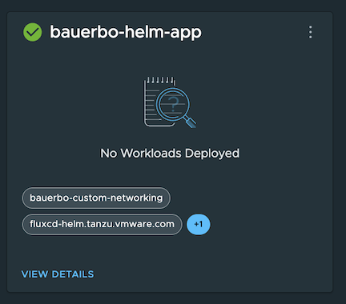

# Deploying Helm Charts and Dockerfiles to Tanzu Platform for Kubernetes

## Overview

In this section we deploy an application using Helm Charts.  This is accomplished by using a Tanzu Platform space that is configured with the FluxCD Helm profile.  We are also using our my-custom-networking profile and creating an additonal profile that has the k8sgateway.tanzu.vmware.com capability to provide ingress for our application.

## Select a Project

In our case we will use our existing project that we used during the previous sections of the course.

1. Make sure you are logged into tanzu platform
```
export TANZU_CLI_CLOUD_SERVICES_ORGANIZATION_ID=XXXX
tanzu login
```
2. Select your project
```
tanzu project list
tanzu project use {foo}
```
3. Select your space
```
tanzu space list
tanzu space use {bar}
```
## Verify our Space is Ready and has required capabilities for Helm deployment

1. From Tanzu Platfrom UI -> Application Spaces -> Spaces -> {your space}
2. Make sure your space shows Ready

3. Expand your space by clicking on view details then select Space Configuration.  Examine the Profiles to verify you see the fluxcd-helm.tanzu.vmware.com, my-custom-networking and gateway-api Profiles.


Bob's clustergroup mutation webhook policy https://chat.google.com/room/AAAA7-TLcC0/qtEJEIWujdU/QZVuuRDL-PE?cls=10
