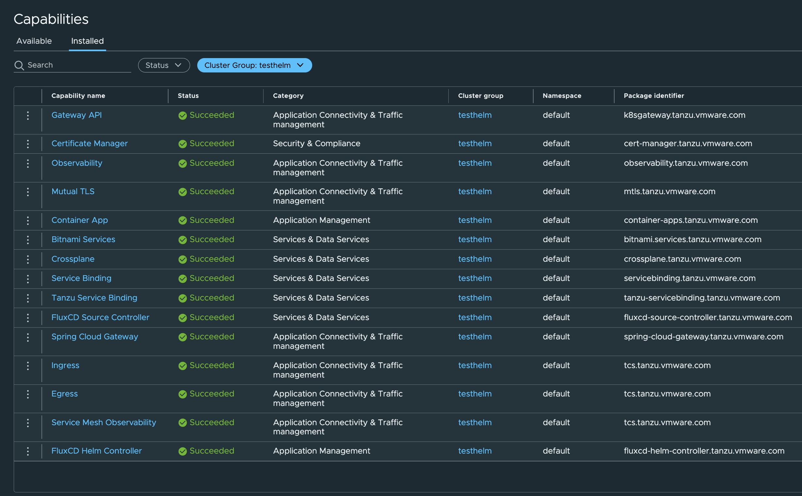

# Deploying Helm Charts and Dockerfiles to Tanzu Platform for Kubernetes

## Overview

In this section we deploy an application using Helm Charts.  This is accomplished by using a Tanzu Platform space that is configured with the FluxCD Helm profile.  We are also using our my-custom-networking profile and creating an additonal profile that has the k8sgateway.tanzu.vmware.com capability to provide ingress for our application.

## Log in to Tanzu Platform for Kubernetes UI

Open your browser to the Tanzu Platform for K8s URL you were given at the begining of the workshop. Log into the Cloud Service Portal with your username and password.  

Once logged in select the Organize supplied for your training using the pull-down under your name in the upper right corner.  Under My Service select Launch Service on the VMware Tanzu Platform tile.


Finally select the project your were instructed to use for the workshop from the pull-down in the upper left.


## Log into Tanzu Platform using the CLI

We will also leverage the Tanzu CLI to work on our spaces and deploy helm charts so we will also log in to the CLI.

1. Set your Organization ID enviornment variable 
```
export TANZU_CLI_CLOUD_SERVICES_ORGANIZATION_ID={org ID provided for workshop}
tanzu login
```
2. Alias kubectl commands to use UCP kubeconfig
```
alias tk='KUBECONFIG=~/.config/tanzu/kube/config kubectl'
```
3. Select the Project you have been using during your workshop
```
tanzu project list
tanzu project use
# follow the interactive menu to select the project you've been assigned to
```
3. Select your cluster group

For this module we will reuse the same clusterg roup you used in your previous sections.  So please select that cluster group using the command below.

```
tanzu operations clustergroup list
tanzu operations clustergroup use
# follow the interactive menu to select the cluster group you previously created
```

## Install Helm Capabilites on your Cluster group

[Official documentation](https://docs.vmware.com/en/VMware-Tanzu-Platform/services/create-manage-apps-tanzu-platform-k8s/how-to-create-run-cluster-group.html#add-packages)

We are going to use the Tanzu CLI to install the cluster group capabilities although these can also be done using the UI (`Application Spaces -> Capabilities`).

We will be reusing the cluster group you used on previous modules, so most of the needed capabilities for our helm application are already installed.

```
# Capabilities Required by Helm Application

# Already installed from Previous Modules
- egress.tanzu.vmware.com
- certificates.tanzu.vmware.com
- multicloud-ingress.tanzu.vmware.com
- k8sgateway.tanzu.vmware.com

# Newly installed below
- fluxcd-helm-controller.tanzu.vmware.com
- fluxcd-source-controller.tanzu.vmware.com
```

```
tanzu package install fluxcd-helm-controller.tanzu.vmware.com -p fluxcd-helm-controller.tanzu.vmware.com -v '>0.0.0'
tanzu package install fluxcd-source-controller.tanzu.vmware.com -p fluxcd-source-controller.tanzu.vmware.com -v '>0.0.0'
```

We can verify the packages corretly installed using the CLI and aliased tk command
```
alias tk='KUBECONFIG=~/.config/tanzu/kube/config kubectl'
tk get pkgi

NAME                                        PACKAGE NAME                                PACKAGE VERSION   DESCRIPTION   AGE
k8sgateway.tanzu.vmware.com                 k8sgateway.tanzu.vmware.com                                                 8m39s
tcs.tanzu.vmware.com                        tcs.tanzu.vmware.com                                                        8m33s
cert-manager.tanzu.vmware.com               cert-manager.tanzu.vmware.com                                               8m48s
observability.tanzu.vmware.com              observability.tanzu.vmware.com                                              8m25s
mtls.tanzu.vmware.com                       mtls.tanzu.vmware.com                                                       7m42s
container-apps.tanzu.vmware.com             container-apps.tanzu.vmware.com                                             7m20s
bitnami.services.tanzu.vmware.com           bitnami.services.tanzu.vmware.com                                           7m27s
crossplane.tanzu.vmware.com                 crossplane.tanzu.vmware.com                                                 7m35s
servicebinding.tanzu.vmware.com             servicebinding.tanzu.vmware.com                                             7m13s
tanzu-servicebinding.tanzu.vmware.com       tanzu-servicebinding.tanzu.vmware.com                                       7m4s
spring-cloud-gateway.tanzu.vmware.com       spring-cloud-gateway.tanzu.vmware.com                                       6m55s
fluxcd-helm-controller.tanzu.vmware.com     fluxcd-helm-controller.tanzu.vmware.com                                     2m28s
fluxcd-source-controller.tanzu.vmware.com   fluxcd-source-controller.tanzu.vmware.com                                   2m17s                
```

We could also check using the Tanzu Platform for Kubernetes UI (`Application Spaces -> Capabilities -> Installed -> Select your cluster group`).  You will see something like this:



## Create Mutation Webhook Policy

[Official Documentation](https://docs.vmware.com/en/VMware-Tanzu-Platform/services/create-manage-apps-tanzu-platform-k8s/how-to-create-mutation-policy.html_)

For TKGs clusters we ship with Pod Security Admission mode set to enforce [Visit this page for more information](https://kubernetes.io/docs/concepts/security/pod-security-admission/).  This means security violations cause a pod to be rejected. The test application we are using breaks the policy and won't be scheduled unless we label the application namespace PSA standard level accordingly.  Since Tanzu Platform for Kubernetes dynamically creates namespaces based on the Space concept, we need a way to automatically label these namespaces to allow our pods to run.

1. Verify that your clustergroup is stil selected in your context

```
tanzu context current
# Cluster Group: {your cluster group} should be one of the variables in the output


```
2. Edit the advanced-topics/templates/psa-mutating-policy.yaml file in this repo and replace `{your clustergroup name}` with the  name of the cluster group you are using.  Note: This is an intentionally broad policy (all clusters in the group and all new namespaces)

```
fullName:
  clusterGroupName: {your clustergroup name}
  name: psa-mutation-policy
meta:
spec:
  input:
    label:
      key: pod-security.kubernetes.io/enforce
........
  ```
3. Create the Mutation Policy

```
tanzu operations policy create -s clustergroup -f templates/psa-mutating-policy.yaml
```

4. You can verify the policy was created using

```
tanzu operations policy list
tanzu operations policy get psa-mutation-policy -n {clustergroup name} -s clustergroup
```

## Flex-Helm Profile

We will be reusing profiles created in the earlier modules (`sping-dev-simple-sa.tanzu.vmware.com`) and your custom network profile (`networking.mydomain.com or yourname-customer-networking`).  We will be using an additional profile to add the fluxcd source and fluxcd helm capabilities to our space.  This demonstrates the additive abilty of reusing profiles grouped around an application type or requirement.

We can use the **Tanzu Provided** `fluxcd-helm.tanzu.vmware.com` profile as it provides the required capabilities fluxcd-helm.tanzu.vmware.com, fluxcd-source.tanzu.vmware.com and traits fluxcd-helmrelease-installer.tanzu.vmware.com to deploy a helm application.

Alternatively you can create your own profile by applying the templates/flux-helm-profile.yaml using the Tanzu CLI or you could even make your own via the UI.

CLI Instructions **(Optional)**

1. Select project (setting this will reset the space or clustergroup in your context).  Commands run from the CLI need to be created in the correct context or you will either get errors or items created in an unexpected place.  It is good practice to alway verify your context before CLI commands.

```
tanzu project use
# follow the interactive menu to select the project you've been assigned to

tanzu context current
  Name:            sa-tanzu-platform
  Type:            tanzu
  Organization:    sa-tanzu-platform (8406......)
  Project:         workshop01 (66cf1......)
  Kube Config:     /home/ubuntu/.config/tanzu/kube/config
  Kube Context:    sa-tanzu-platform:workshop01

  # Note there is no Space or Clustergroup specificed
```
2. Apply flux-helm-profile.yaml  from templates folder

```
tanzu deploy --only templates/flux-helm-profile.yaml

Target cluster 'https://api.tanzu.cloud.vmware.com/org/8406e52e-.............'

Changes

Namespace  Name               Kind     Age  Op      Op st.  Wait to  Rs  Ri
default    flux-helm-profile  Profile  12h  update  -       -        ok  -

Op:      0 create, 0 delete, 1 update, 0 noop, 0 exists
Wait to: 0 reconcile, 0 delete, 1 noop

Continue? [yN]: y

5:00:36PM: ---- applying 1 changes [0/1 done] ----
5:00:36PM: update profile/flux-helm-profile (spaces.tanzu.vmware.com/v1alpha1) namespace: default
5:00:36PM: ---- waiting on 1 changes [0/1 done] ----
5:00:36PM: ok: noop profile/flux-helm-profile (spaces.tanzu.vmware.com/v1alpha1) namespace: default
5:00:36PM: ---- applying complete [1/1 done] ----
5:00:36PM: ---- waiting complete [1/1 done] ----
```
3. Verify Policy was created and Ready is True

```
tanzu profile list
Listing profiles from Tanzu Platform for sa-tanzu-platform
  NAME                                   READY  TRAITS RESOLVED  AGE
  bauerbo-custom-networking              True   3/3              40d
  flux-helm-profile                      True   1/1              12h
  fluxcd-helm.tanzu.vmware.com           True   1/1              42d
  gateway-api                            True   0/0              18d
  k8s-containerapp                       True   1/1              7d19h
  networking.tanzu.vmware.com            True   3/3              42d
  spring-dev-simple-sa.tanzu.vmware.com  True   2/2              3h11m
  spring-dev.tanzu.vmware.com            True   3/3              42d
  spring-prod.tanzu.vmware.com           True   3/3              42d
```
## Create Helm App Space

Access the Tanzu Platform GUI: `Application Spaces -> Spaces -> Create Space -> Step by Step`

1. Space Name
    - Choose a unique name and something different than you've used for other spaces in this workshop.  Example: `yourname-helm-app`
2. Select Profiles
    - Select your custom networking profile you created in previous module
    - Select the spring-dev-simple-sa.tanzu.vmware.com profile
    - Select the fluxcd-helm.tanzu.vmware.com (or custom flux profile you create)
3. Availability Targets
    - Add the availabilty target which contains the clustergroup you've installed the capabilities on in previous modules and above in this module (example bauerbo-at-tkgs)
    - Set Replicas to 1
4. Click `Create Space`
5. View your Space in the Space page.  It will take some time for the Space to become ready.  Use the Refesh in upper right to refresh the view


6. Expand your space by clicking on `View Details -> Space Configuration` You should see the 3 Profiles you added in Step 2 of Space Creation


## Install Helm charts in a Space

[Official Documentation](https://docs.vmware.com/en/VMware-Tanzu-Platform/services/create-manage-apps-tanzu-platform-k8s/how-to-helm-charts-in-spaces.html)

In the `podinfo`folder there are 4 yaml files used to deploy a simple application using helm

```
find .
.
./helmrepository.yaml
./helmrelease.yaml
./podinfo-values.yaml
./route.yaml
```

helmrepository.yaml
- Defines Helm repository location for Flux

helmrelease.yaml
- Defines Helm chart to install (fetched from referenced repository) and provide configuration values

podinfo-values.yaml
- Secret used to provided additional values for Helm Release

route.yaml
- Configuration to expose Podinfo application using `HTTPRoute API`

We do not need to modify any of these files.  We can simply select our space we want to deploy the application to and use `tanzu deploy` to apply the YAML files to UCP.

### Deploy Helm Application

1. Set your Space to the helm-app space you created

```
tanzu space list
tanzu space use
# follow the interactive menu to select the space you created

# Optional view your context to see you have the correct project and space selected
tanzu context current
  Name:            sa-tanzu-platform
  Type:            tanzu
  Organization:    sa-tanzu-platform (8406e5......)
  Project:         workshop01 (66cf1f......)
  Space:           bauerbo-helm-app
  Kube Config:     /home/ubuntu/.config/tanzu/kube/config
  Kube Context:    sa-tanzu-platform:workshop01:bauerbo-helm-app
```
2. Deploy Helm Resources

```
tanzu deploy --only podinfo/.
Target cluster 'https://api.tanzu.cloud.vmware.com/org/8406e52e-6e36-445a-be7b-9dab6903341e/project/66cf1fd9-0ff9-42d6-9be0-022dd473e1dc/space/bauerbo-helm-app'

Changes

Namespace  Name            Kind            Age  Op      Op st.  Wait to  Rs  Ri
default    podinfo         HelmRelease     -    create  -       -        -   -
^          podinfo         HelmRepository  -    create  -       -        -   -
^          podinfo-main    HTTPRoute       -    create  -       -        -   -
^          podinfo-values  Secret          -    create  -       -        -   -

Op:      4 create, 0 delete, 0 update, 0 noop, 0 exists
Wait to: 0 reconcile, 0 delete, 4 noop

Continue? [yN]: y

6:05:13PM: ---- applying 1 changes [0/4 done] ----
6:05:13PM: create secret/podinfo-values (v1) namespace: default
6:05:13PM: ---- waiting on 1 changes [0/4 done] ----
6:05:13PM: ok: noop secret/podinfo-values (v1) namespace: default
6:05:13PM: ---- applying 3 changes [1/4 done] ----
6:05:13PM: create helmrepository/podinfo (source.toolkit.fluxcd.io/v1) namespace: default
6:05:13PM: create helmrelease/podinfo (helm.toolkit.fluxcd.io/v2) namespace: default
6:05:13PM: create httproute/podinfo-main (gateway.networking.k8s.io/v1beta1) namespace: default
6:05:13PM: ---- waiting on 3 changes [1/4 done] ----
6:05:13PM: ok: noop httproute/podinfo-main (gateway.networking.k8s.io/v1beta1) namespace: default
6:05:13PM: ok: noop helmrepository/podinfo (source.toolkit.fluxcd.io/v1) namespace: default
6:05:13PM: ok: noop helmrelease/podinfo (helm.toolkit.fluxcd.io/v2) namespace: default
6:05:13PM: ---- applying complete [4/4 done] ----
6:05:13PM: ---- waiting complete [4/4 done] ----
```
