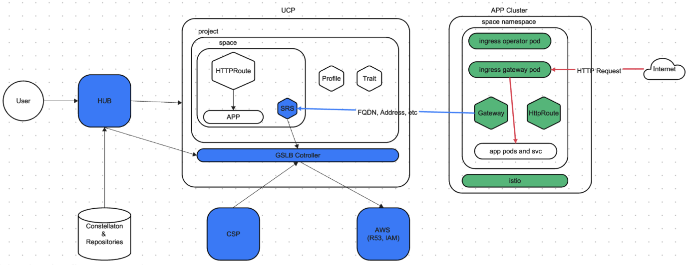

# Platform Engineer Hands-on Lab

## Share Environment details and confirm pre-requisites
The workshop owner should share with the attendees:
- Designated Tanzu Platform for k8s URL, Org and Project.
- vSphere environment url, credentials, Supervisor name used to register in Tanzu Platform, and Supervisor namespace name.
- Route53 Credential ID, Hosted Zone ID, and designated subdomain.

All workshop participants to verify they are all set with steps in [Workshop Attendee pre-requisites](../lab-platform-engineer/00-prerequisites.md#workshop-attendee-pre-requisites)

## Log in on the Tanzu Platform for Kubernetes 
On the browser, open a new tab/window and go to the Tanzu Platform for k8s URL you've been given. Log in. Then make sure to select the Organization, and later the Project you've been assigned.

Once that's done, open a terminal and run this commands, use the Organziation ID you've been given:
```
export TANZU_CLI_CLOUD_SERVICES_ORGANIZATION_ID=XXXX
tanzu login
```


## Register TKGS Supervisor in designated Tanzu Platform for k8s project

> Note: This step of the workshop may be skipped if several attendees are sharing environments with the same Supervisor

Official pubic documentation pending

[vSphere with Tanzu documentation to register Supervisor in TMC](https://docs.vmware.com/en/VMware-vSphere/8.0/vsphere-with-tanzu-installation-configuration/GUID-ED4417DC-592C-454A-8292-97F93BD76957.html#install-the-tanzu-mission-control-agent-on-the-supervisor-1)

Process:
- Step 1: Access the Hub GUI: `Setup & Configuration > Kubernetes Management > TKG Registrations > Register TKG Instance` to get the registration url
- Step 2: Go to VCenter: `workload management > Supervisors > Configure > Tanzu Mission Control Registration`, and add that registration url.

There is an alternative process to be followed via CLI with a yaml. (Insert info here)

## Prepare a Cluster Group with required capabilities

#### Create Cluster Group
[Official documentation](https://docs.vmware.com/en/VMware-Tanzu-Platform/services/create-manage-apps-tanzu-platform-k8s/how-to-create-run-cluster-group.html)

Access the Hub GUI: `Infrastructure > Kubedrnetes Clusters > Create Cluster Group > Choose a name`.

Make sure to enable Tanzu Application Engine.

Alternatively you can do this via CLI. Follow this commands using the `cluster-group.yaml` sample file included in this folder of the repo, make sure to change the `fullName.name`:
```
tanzu project use 
# follow the interactive menu to select the project you've been assigned to

tanzu operations clustergroup create -f cluster-group.yaml
```


#### What are capabilities and what the Platform Engineer needs to do with them
[Official documentation](https://docs.vmware.com/en/VMware-Tanzu-Platform/services/create-manage-apps-tanzu-platform-k8s/concepts-about-spaces.html#capabilities--platform-apis-and-features-1)

(Insert image or link to diagram here)

#### Add capabilities to Cluster Group
[Official documentation](https://docs.vmware.com/en/VMware-Tanzu-Platform/services/create-manage-apps-tanzu-platform-k8s/how-to-create-run-cluster-group.html#add-packages)

To do this from the Hub GUI, go to: `Application Spaces > Capabilities > Available`. We can only add capabilities one by one, and curerntly you can only select a specific version, which will actually pin that version in the installed packages, which can cause issues when new Capability versions are released and their pacages bumped in the Platform (UCP).

Therefore we will do this via CLI

We need to install all capabilities that we are going to need in the Spaces we want to create. Spaces request capabilities via Profiles and looking at the profiles we need to use in the workshop, these are the capabilities we want to look at:
- Capabilities needed by the GSLB ingress Profile an its traits and capabilities
	- Certificate Manager (several depend on this capability)
	- Egress
	- Ingress
	- Gateway API
- Additional Capabilities needed by the spring-dev profile: observability and carvel-package traits, and other capabilities
	- Observability
	- Service Mesh Observability
	- Mutual TLS
	- Bitnami
	- Container Apps
	- Service Binding (Tanzu Service Binding Dependency)
	- Tanzu Service Binding
	- Spring Cloud Gateway.tanzu.vmware.com (can be skipped if not needed by app)
	- Crossplane (Bitnami's dependency)
> Note: Egress, Ingress and Service Mesh Observability capabilities are all provided by the same `tcs` meta package today

To install the necessary capabilities run these commands
```
# select project
tanzu project use 
# follow the interactive menu to select the project you've been assigned to

# select cluster group 
tanzu operations clustergroup use
# follow the interactive menu to select the cluster gorup we just created

# install capabilities - version is mandatory: you can pin a specific version or use the '>' operator
tanzu package install cert-manager.tanzu.vmware.com -p cert-manager.tanzu.vmware.com -v '>0.0.0'
tanzu package install k8sgateway.tanzu.vmware.com -p k8sgateway.tanzu.vmware.com -v '>0.0.0'
tanzu package install tcs.tanzu.vmware.com -p tcs.tanzu.vmware.com -v '>0.0.0'
tanzu package install observability.tanzu.vmware.com -p observability.tanzu.vmware.com -v '>0.0.0'
tanzu package install mtls.tanzu.vmware.com -p mtls.tanzu.vmware.com -v '>0.0.0'
tanzu package install crossplane.tanzu.vmware.com -p crossplane.tanzu.vmware.com -v '>0.0.0'
tanzu package install bitnami.services.tanzu.vmware.com -p bitnami.services.tanzu.vmware.com -v '>0.0.0'
tanzu package install container-apps.tanzu.vmware.com -p container-apps.tanzu.vmware.com -v '>0.0.0'
tanzu package install servicebinding.tanzu.vmware.com -p servicebinding.tanzu.vmware.com -v '>0.0.0'
tanzu package install tanzu-servicebinding.tanzu.vmware.com -p tanzu-servicebinding.tanzu.vmware.com -v '>0.0.0'
tanzu package install spring-cloud-gateway.tanzu.vmware.com -p spring-cloud-gateway.tanzu.vmware.com -v '>0.0.0'
```

#### (Optionl) Remove needed capability to test error scenario
Remove Crossplane capability from the Cluster Group: if not choosing it the bitnami package will fail:
- When that capability deployment fails, space scheduling will stay in WARNING
- Once you add crossplane, bitnami package will reconcyle.
- After that Space should go ready after .... 1 or 2 minutes

## Create a TKGS cluster in your Cluster Group
Official pubic documentation pending

Access the Hub GUI: `Infrastructure > Kuberentes Clusters > Clusters > Add Cluster > Create Tanzu Kubernetes Grid Cluster`:
- Step 1: Select the management cluster and provisioner
    - The management cluster is the Supervisor cluster that the workshop owner provided you.
    - Provisioner: click to show a drop down menu and choose the name of the Supervisor Namespace that the workshop owner provided you.
- Step 2: Name and assign
    - Cluster name: pick a name. Tip: use something unique in it like your name and use a suffix with a number (you may create 2 clusters)
    - Cluster Group: click to show a drop down menu and choose the Cluster Group you created earlier.
    - Cluster class: click to show a drop down menu and choose `tanzukubernetesclusterclass`.
    - Labels: DO NOT SKIP! Choose a couple of labels to have options later to target your clusters. Examples:
        - `vsphere: 8.0.2c` -> to identify it as a TKGS/VCF cluster with version
        - `test-jaime: true` -> to identify it as one of my test clusters (change to somehting unique for you)
- Step 3: Configure network and storage settings
    - Under Allowed storage clases, click on Add Storage Class and select the storage class from the drop down menu.
    - Under Default storage classe, do the same.
    - Leave all other defaults untouched.
- Step 4: Control plane
    - Kubernetes version: choose v1.28.8 (recommended) or 1.27.11 - the rest of them are not compatible with the platform.
    - OS version: choose either photon or ubuntu, both should work fine.
    - Instance type: choose `best-effort-large` (4VCPU & 16GBMem) or bigger.
    - Strage class: choose the same storage class you chose earlier.
    - Leave all other defaults untouched.
- Step 5: Configure default volumnes
    - No need to add anything.
- Step 6: Conigure node pool
    - Worker count: 3
    - Instance type: choose `best-effort-large` (4VCPU & 16GBMem) or bigger.
    - Storage class: choose the same storage class you chose earlier.
    - OS version: choose either photon or ubuntu, both should work fine.
    - Failure domain: chooe `vmware-system-legacy`
    - Leave all other defaults untouched
- Step 7: Additional cluster configuration
    - No need to add anything.
- Click Create.

Alternatively you can do this via CLI. Follow this commands using the `tkgs-cluster.yaml` sample file included in this folder of the repo, make sure to adjust: all the `fullName` variables, the `spec.clusterGroupName` and all references to storageClass at minimu:
```
tanzu project use <project-name>
tanzu operations apply -f tkgs-cluster.yaml
```


#### Confirm TKGS cluster is onboarded to the Platform
1. Confirm the Cluster is Healthy and Ready
    - This is the TMC layer, does not provide information about the UCP onboarding
    - Access the Hub GUI: `Infrastructure > Kubernetes Clusters > Clusters` and confirm it's `Healthy` and `Ready`.
    - CLI path: check status conditions
        ```
        tanzu project use <project-name>
        tanzu operations cluster get <cluster-name> -p <supervisor-namespace> -m <supervisor-name > | yq .status
        ```
2. Confirm the Cluster is properly onboarded to UCP
    - Access the Hub GUI: `Setup & Configuration > Kubernetes Management` and confirm it is `Attached` and the Colector status is `Online`
    - CLI path: check status conditions
        ```
        tanzu operations clustergroup use <cluster-group-name>
        alias tk='KUBECONFIG=~/.config/tanzu/kube/config kubectl'
        tk get kubernetesclusters <cluster-name> -oyaml | yq .status
        ```

#### Confirm via UCP that capabilities defined in cluster group are provided by the

To check the cluster has all the capabilities we initially defined at cluster-group level, run the following commands:
```
tanzu project use <project-name>
tanzu operations clustergroup use <cluster-group-name>
alias tk='KUBECONFIG=~/.config/tanzu/kube/config kubectl'
tk get kubernetesclusters <cluster-name> -oyaml | yq .status.capabilities
```

#### Inspect Packages and Agents intalled
1. Acccess the target cluster. Two ways:
    1. Access the Hub GUI: `Infrastructure > Kuberentes Clusters > Clusters > Click on the cluster name > Actions > Access this cluster`
        - Download the Kubeconfig. Export the file (adjust path) and teste it with these commands
        ```
        tanzu project use <project-name>
        export KUBECONFIG=/full/path/to/kconfig/kubeconfig-<cluster-name>>.yml
        kubectl get no -owide
        ```
    1. Leverage vsphere plugin. Type the password when prompted.
        ```
        kubectl vsphere login --server <supervisor-ip> --insecure-skip-tls-verify -u administrator@vsphere.local --tanzu-kubernetes-cluster-name <cluster-name> --tanzu-kubernetes-cluster-namespace <supervisor-namespace>
        ```

2. Check the following namespaces
```
kubectl get ns
# make sure these namespaces exist - they are the additional namespaces created by UCP/TMC
NAME                           STATUS   AGE
cert-manager                   Active   15h   # added from capabilities
crossplane-system              Active   15h   # added from capabilities
istio-cni-system               Active   15h   # added from capabilities
istio-system                   Active   15h   # added from capabilities
service-bindings               Active   15h   # added from capabilities
spring-cloud-gateway           Active   15h   # added from capabilities
tanzu-cluster-group-system     Active   15h   # added from ucp
tanzu-containerapp             Active   15h   # added from capabilities
tanzu-service-bindings         Active   15h   # added from capabilities
tanzu-system                   Active   15h   # added from ucp
vmware-system-tmc              Active   15h   # added from tmc
```

3. Check the following packages
```
kubectl get pkgi -A
NAMESPACE                    NAME                                              PACKAGE NAME                                  PACKAGE VERSION                DESCRIPTION           AGE
tanzu-cluster-group-system   bitnami.services.tanzu.vmware.com                 bitnami.services.tanzu.vmware.com             0.6.0                          Reconcile succeeded   15h   # added from capabilities
tanzu-cluster-group-system   cert-manager.tanzu.vmware.com                     cert-manager.tanzu.vmware.com                 2.9.1                          Reconcile succeeded   15h   # added from capabilities
tanzu-cluster-group-system   container-apps.tanzu.vmware.com                   container-apps.tanzu.vmware.com               0.0.3+1715585258.1ef0f6e7      Reconcile succeeded   15h   # added from capabilities
tanzu-cluster-group-system   crossplane.tanzu.vmware.com                       crossplane.tanzu.vmware.com                   0.6.0                          Reconcile succeeded   15h   # added from capabilities
tanzu-cluster-group-system   k8sgateway.tanzu.vmware.com                       k8sgateway.tanzu.vmware.com                   0.0.7                          Reconcile succeeded   15h   # added from capabilities
tanzu-cluster-group-system   mtls.tanzu.vmware.com                             mtls.tanzu.vmware.com                         0.0.1                          Reconcile succeeded   15h   # added from capabilities
tanzu-cluster-group-system   observability.tanzu.vmware.com                    observability.tanzu.vmware.com                1.0.13                         Reconcile succeeded   15h   # added from capabilities
tanzu-cluster-group-system   servicebinding.tanzu.vmware.com                   servicebinding.tanzu.vmware.com               0.13.0                         Reconcile succeeded   15h   # added from capabilities
tanzu-cluster-group-system   spring-cloud-gateway.tanzu.vmware.com             spring-cloud-gateway.tanzu.vmware.com         2.2.4                          Reconcile succeeded   15h   # added from capabilities
tanzu-cluster-group-system   tanzu-servicebinding.tanzu.vmware.com             tanzu-servicebinding.tanzu.vmware.com         1.0.0+1715584031.31092f96      Reconcile succeeded   15h   # added from capabilities
tanzu-cluster-group-system   tcs.tanzu.vmware.com                              tcs.tanzu.vmware.com                          2.2.7                          Reconcile succeeded   15h   # added from capabilities
tanzu-system                 capabilities-controller                           capabilities-controller.tanzu.vmware.com      1.0.0+release.15.607ff05fe     Reconcile succeeded   15h   # added from ucp
tanzu-system                 syncer                                            syncer.ucp.tanzu.vmware.com                   1.0.0+release.15.607ff05fe     Reconcile succeeded   15h   # added from ucp
tanzu-system                 vss-k8s-collector                                 vss-k8s-collector.tanzu.vmware.com            3.17.1                         Reconcile succeeded   15h   # added from ucp
```


## Create Availability Targets
[Official documentation](https://docs.vmware.com/en/VMware-Tanzu-Platform/services/create-manage-apps-tanzu-platform-k8s/how-to-manage-availability-targets.html)

#### Look at existing Availability Target pointing to our EKS overflow clusters
- Access the Hub GUI: `Application Spaces > Availability Targets > type "workshop+ENTER" > Click on "View Details" in the workshop-overflow AT`.
- See the list of clusters: these are all EKS clusters we have available in our project for extra compute for our Spaces. More on this later
- On the top right click on `Actions > View YAML`. Scroll down to `spec.affinity.clusterAffinity`
- Observe the matchingExpresion looking for clusters with a label `workshop-overflow`


#### Create an Availability Target that targets our TKGS cluster
We will use the yaml/CLI apprach to define & create the Availability Target to have more flexibility and to use a single matchExpression with two elements in order to have it work as an AND logical operator, which is not currently supported in the UI.

Check the `at-tkgs.yaml` file in this folder of the repo and notice to elements in the matchExpressions array: we want this availability target to match clusters that have the first label AND the second label. Let's keep the `vsphere` label and edit the other one to be something unique for you that describes your clusters. Then create the AT following these commands:
```
tanzu project use <project-name>
tanzu availability-target apply -f at-tkgs.yaml
```

#### (Optional) Create an Availability Target that targets the TKGS cluster and the EKS overflow clusters


## Configure a GSLB via custom Profile
In order to configure a Space with the right Ingress and GSLB settings for apps running on the Space, we need to create a Profile that configures the Ingress Trait. And later on, developers (at the moment) must create the HTTPRoute resources with specifics of the subdomain, ports and paths to be used to route traffic to the application.
Ingress Trait and HTTPRoute objects are the primary inputs that are used to setup networking for exposing an application.
- The ingress trait installation brings up ingress operator pod in the Space namespace on the app cluster. This operator is responsible for programing Gateway object reading inputs from the Trait and the HTTPRoute
- ISTIO uses Gateway to dynamically bring up the gateway proxy services (deployment and service) to allow public traffic into the Space.

Here's the Ingress and GSLB Architecture:



## Create a Space for developers to deploy apps on TKGS