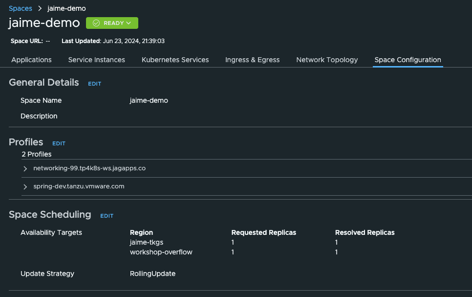

# Platform Engineer Hands-on Lab

## Share Environment details and confirm pre-requisites
The workshop owner should share with the attendees:
- Designated Tanzu Platform for k8s URL, Org and Project.
- vSphere environment url, credentials, Supervisor name used to register in Tanzu Platform, and Supervisor namespace name.
- Route53 Credential ID, Hosted Zone ID, and designated subdomain.

All workshop participants must verify they are all set with steps in [Workshop Attendee pre-requisites](../lab-platform-engineer/00-prerequisites.md#workshop-attendee-pre-requisites)

## Log in the Tanzu Platform for Kubernetes 
On the browser, open a new tab/window and go to the Tanzu Platform for k8s URL you've been given at the begining of the workshop. Log in. Then make sure to select the Organization, and later the Project you've been assigned.

Once that's done, open a terminal and run these commands, use the Organization ID you've been given:
```
export TANZU_CLI_CLOUD_SERVICES_ORGANIZATION_ID=XXXX
tanzu login
```

The Tanzu CLI and the plugins we use interact with the Tanzu Platform Unified Control Plane as a K8s API. The the CLI keeps the KUBECONFIG configuration and the contexts to interact with the UCP in `~/.config/tanzu/kube/config`. When we run the "use" sub-commands of the project, space and clustergroup plugins, we are adjusting the context to point to the right level of the hierarchy of resources in UCP:
```
Organization
|
 -- Projects
    |
     -- Spaces / Cluster Groups
```

Check what happens with the Tanzu CLI context when you target a project
```
tanzu project use
# choose a valid project from the list, e.g: workshop01
tanzu context current | grep -E "Kube Context"
#  Kube Context:    tanzu-cli-sa-tanzu-platform:workshop01
```

If there are spaces available, check what happens with the Tanzu CLI context when you target a space. If there are no spaces available in the project yet, come back here once you create a space.
```
tanzu space use
# choose a valid space from the list
tanzu context current | grep -E "Kube Context"
#  Kube Context:    tanzu-cli-sa-tanzu-platform:workshop01:space-name 
```

More on this in the [documentation](https://docs.vmware.com/en/VMware-Tanzu-Platform/services/create-manage-apps-tanzu-platform-k8s/how-to-create-and-manage-cli-contexts.html)

During this workshop we will also use `kubectl` to access some UCP resources. To be able to do that you can set your `KUBECONFIG` environment variable to point to that `~/.config/tanzu/kube/config` file. Or even create an alias to only use that `KUBECONFIG` when you need to check UCP resources, and leave the default KUBECONFIG (`~/.kube/config`) for regular use of kubectl to access the k8s clusters:
```
alias tk='KUBECONFIG=~/.config/tanzu/kube/config kubectl'
```

Throughout this lab of the workshop you will see how there are many resources that are created at UCP level, and automatically copied over, and kept in sync, in the k8s clusters where applications will run. At a high level:


## Register TKGS Supervisor in designated Tanzu Platform for k8s project

> Note: This step of the workshop may be skipped if several attendees are sharing environments with the same Supervisor

[Official Documentation](https://docs.vmware.com/en/VMware-Tanzu-Platform/services/create-manage-apps-tanzu-platform-k8s/how-to-register-supervisor-cluster.html)

[vSphere with Tanzu documentation to register Supervisor in TMC](https://docs.vmware.com/en/VMware-vSphere/8.0/vsphere-with-tanzu-installation-configuration/GUID-ED4417DC-592C-454A-8292-97F93BD76957.html#install-the-tanzu-mission-control-agent-on-the-supervisor-1)

Process:
- Step 1: Access the Hub GUI: `Setup & Configuration > Kubernetes Management > TKG Registrations > Register TKG Instance` to get the registration url
- Step 2: Go to VCenter: `workload management > Supervisors > Configure > Tanzu Mission Control Registration`, and add that registration url.

There is an alternative process to be followed via CLI, which you can find in the official documentation linked above.

## Tanzu Platform Concepts and Relationships to keep handy
As a Platform Engineer we need to be able to configure the Platform and prepare repeatable and configurable environmments for the application team to deploy applications into. These are the Spaces. But they are not the only construct that Platform Engineers need to get familiar with. Throughout this lab we will get introduced to all of them through the lens of the Platform Engineer. At a high level we need to know what these are:
- Cluster Groups: are groupings of Kubernetes Clusters with provided Software (Capabilities) installed on those Clusters. They enable platform engineers to curate what combination of Capabilities will be provided by their platform.
- Capabilities: are named groups that describe the APIs and features available from the Platform.
    - In order to curate the APIs available to users, Spaces require Capabilities (indirectly, via profiles). This has the effect of determining precisely which Kubernetes APIs will be exposed to users and their tools in a given Space.
    - In order to support the APIs required to run the applications and handle the resources within a Space, Clusters provide Capabilities. A Cluster that provides Capabilities ensures the Custom Resource Definitions (CRDs) and their respective controllers are available to the applications that run in a Space on that cluster.
- Availability Targets:  are groupings of Clusters that allow users to define where their application will be scheduled
    - Spaces include Availability Targets to describe where they should be scheduled. This has the effect of determining which clusters, in a specific physical or logical location, should be used as a target for the Space.
- Profiles: are groupings of required Capabilities that have a consistent, semantic meaning within an organization. They enable platform builders to curate what workload characteristics will be supported by their platform and for users to reference those characteristics without knowing details about how they are implemented.
    - Spaces include Profiles to describe the characteristics (in the form of Capabilities) of the Space. This has the effect of adding required Capabilities to the Space and influencing where it is scheduled; Spaces transitively require all Capabilities that are required by any Profiles a Space includes.
    - The Profiles included in a Space also have an impact in the Space scheduling: only clusters from Cluster Groups that provide all required capabilities in the Profiles will be candidates to be used as a target for the Space.
- Traits: are collections of Kubernetes resources that are deployed into Spaces when they are created. They deliver required, pre-configured, and consistent content to Spaces.
    - Profiles include Traits to deploy reusable content into Spaces when they are scheduled. This has the effect of automating the configuration and creation of Kubernetes resources, for users.


Here's a conceptual diagram with how these relate to each other:


More on this in the [Tanzu Application Engine Conceptual Overview documentation](https://docs.vmware.com/en/VMware-Tanzu-Platform/services/create-manage-apps-tanzu-platform-k8s/concepts-about-spaces.html)

In a day in the life of a Platform Engineer we will start by creating a Cluster Group, to structure the underlying Kubernetes infrastructure and define the Capabilities we want to install and expose to the Application teams.

## Prepare a Cluster Group with required capabilities

#### Create Cluster Group
[Official documentation](https://docs.vmware.com/en/VMware-Tanzu-Platform/services/create-manage-apps-tanzu-platform-k8s/how-to-create-run-cluster-group.html)

Access the Hub GUI: `Infrastructure > Kubedrnetes Clusters > Create Cluster Group`. Choose a name that's unique for you (e.g: name-cg)

Make sure to enable Tanzu Application Engine.

Alternatively you can do this via CLI. Follow this commands using the `cluster-group.yaml` sample template file included in this folder of the repo, make sure to change the `fullName.name`:
```
tanzu project use 
# follow the interactive menu to select the project you've been assigned to

tanzu operations clustergroup create -f templates/cluster-group.yaml
```

#### Add capabilities to Cluster Group
[Official documentation](https://docs.vmware.com/en/VMware-Tanzu-Platform/services/create-manage-apps-tanzu-platform-k8s/how-to-create-run-cluster-group.html#add-packages)

To do this from the Hub GUI, go to: `Application Spaces > Capabilities > Available`. With the GUI we can only add capabilities one by one so it is
more efficient to add multiple capabilities to a cluster group through the CLI.

Therefore we will do this via CLI

We need to install all capabilities that we are going to need in the Spaces we want to create. Spaces request capabilities via Profiles and looking at the profiles we need to use in the workshop, these are the capabilities we want to look at:
- Capabilities needed by the GSLB ingress Profile an its traits and capabilities
	- Certificate Manager (several depend on this capability)
	- Egress
	- Ingress
	- Gateway API
- Additional Capabilities needed by the spring-dev profile: observability and carvel-package traits, and other capabilities
	- Observability
	- Service Mesh Observability
	- Mutual TLS
	- Bitnami Services
	- Container App
	- Service Binding (Tanzu Service Binding Dependency)
	- Tanzu Service Binding
	- Spring Cloud Gateway (can be skipped if not needed by app)
	- Crossplane (Bitnami's dependency)
> Note: Ingress and Service Mesh Observability capabilities are all provided by the same `tcs` package today. To provide those capabilities we will install that `tcs` package as you will see below.


To install the necessary capabilities run these commands
```
# select project
tanzu project use 
# follow the interactive menu to select the project you've been assigned to

# select cluster group 
tanzu operations clustergroup use
# follow the interactive menu to select the cluster gorup we just created

# install capabilities - version is mandatory: you can pin a specific version or use the '>' operator
tanzu package install cert-manager.tanzu.vmware.com -p cert-manager.tanzu.vmware.com -v '>0.0.0'
tanzu package install k8sgateway.tanzu.vmware.com -p k8sgateway.tanzu.vmware.com -v '>0.0.0'
tanzu package install tcs.tanzu.vmware.com -p tcs.tanzu.vmware.com -v '>0.0.0'
tanzu package install egress.tanzu.vmware.com -p egress.tanzu.vmware.com -v '>0.0.0'
tanzu package install observability.tanzu.vmware.com -p observability.tanzu.vmware.com -v '>0.0.0'
tanzu package install mtls.tanzu.vmware.com -p mtls.tanzu.vmware.com -v '>0.0.0'
tanzu package install crossplane.tanzu.vmware.com -p crossplane.tanzu.vmware.com -v '>0.0.0'
tanzu package install bitnami.services.tanzu.vmware.com -p bitnami.services.tanzu.vmware.com -v '>0.0.0'
tanzu package install container-apps.tanzu.vmware.com -p container-apps.tanzu.vmware.com -v '>0.0.0'
tanzu package install servicebinding.tanzu.vmware.com -p servicebinding.tanzu.vmware.com -v '>0.0.0'
tanzu package install tanzu-servicebinding.tanzu.vmware.com -p tanzu-servicebinding.tanzu.vmware.com -v '>0.0.0'
tanzu package install spring-cloud-gateway.tanzu.vmware.com -p spring-cloud-gateway.tanzu.vmware.com -v '>0.0.0'
```

After the commands run return to the GUI (`Application Spaces > Capabilities > Installed`) to see all capabilities `Ready`. If the drop down menu does not show your Cluster Group, edit and go to this url with your cluster name as parameter:
```
https://www.mgmt.cloud.vmware.com/hub/application-engine/capabilities?view=installed&clusterGroup=jaime-cg-demo
```
You should see something like this:


Via command line you can check all the Packages (pkgi resource) for those Capabilities are created by running these commands:
```
alias tk='KUBECONFIG=~/.config/tanzu/kube/config kubectl'
tk get pkgi
NAME                                    PACKAGE NAME                            PACKAGE VERSION   DESCRIPTION   AGE
cert-manager.tanzu.vmware.com           cert-manager.tanzu.vmware.com                                           2m8s
k8sgateway.tanzu.vmware.com             k8sgateway.tanzu.vmware.com                                             2m7s
tcs.tanzu.vmware.com                    tcs.tanzu.vmware.com                                                    2m5s
egress.tanzu.vmware.com                 egress.tanzu.vmware.com                                                 2m5s
observability.tanzu.vmware.com          observability.tanzu.vmware.com                                          2m4s
mtls.tanzu.vmware.com                   mtls.tanzu.vmware.com                                                   2m4s
crossplane.tanzu.vmware.com             crossplane.tanzu.vmware.com                                             2m2s
bitnami.services.tanzu.vmware.com       bitnami.services.tanzu.vmware.com                                       2m2s
container-apps.tanzu.vmware.com         container-apps.tanzu.vmware.com                                         2m
servicebinding.tanzu.vmware.com         servicebinding.tanzu.vmware.com                                         119s
tanzu-servicebinding.tanzu.vmware.com   tanzu-servicebinding.tanzu.vmware.com                                   118s
spring-cloud-gateway.tanzu.vmware.com   spring-cloud-gateway.tanzu.vmware.com                                   117s
```

#### (Optional) Remove needed capability to test error scenario
Remove Crossplane capability from the Cluster Group:
- When that capability is missing, bitnami capability fails to reconcile, and space scheduling will stay in WARNING since there is no cluster that provides(satisfies) all required capabilities
- Once you add crossplane, bitnami package will reconcile.
- After that Space should go ready after .... 1 or 2 minutes

## Create a TKGS cluster in your Cluster Group
[Official documentation](https://docs.vmware.com/en/VMware-Tanzu-Platform/services/create-manage-apps-tanzu-platform-k8s/how-to-add-cluster-tkg-new.html)

Access the Hub GUI: `Infrastructure > Kuberentes Clusters > Clusters > Add Cluster > Create Tanzu Kubernetes Grid Cluster`:
- Step 1: Select the management cluster and provisioner
    - The management cluster is the Supervisor cluster that the workshop owner provided you.
    - Provisioner: click to show a drop down menu and choose the name of the Supervisor Namespace that the workshop owner provided you.
- Step 2: Name and assign
    - Cluster name: pick a name. Tip: use something unique in it like your name and use a suffix with a number.
    - Cluster Group: click to show a drop down menu and choose the Cluster Group you created earlier.
    - Cluster class: click to show a drop down menu and choose `tanzukubernetesclusterclass`.
    - Labels: DO NOT SKIP! Choose a couple of labels to have options later to target your clusters. Examples:
        - `vsphere: 8.0.2c` -> to identify it as a TKGS/VCF cluster with version
        - `jaime-demo: true` -> to identify it as one of my test clusters (change to somehting unique for you)
- Step 3: Configure network and storage settings
    - Under Allowed storage classes, click on Add Storage Class and select the storage class from the drop down menu.
    - Under Default storage class, do the same.
    - Leave all other defaults untouched.
- Step 4: Control plane
    - Kubernetes version: choose v1.28.8 (recommended) or 1.27.11 - the rest of them are not compatible with the platform.
    - OS version: choose either photon or ubuntu, both should work fine.
    - Instance type: choose `best-effort-large` (4VCPU & 16GBMem) or bigger.
    - Storage class: choose the same storage class you chose earlier.
    - Leave all other defaults untouched.
- Step 5: Configure default volumes
    - No need to add anything.
- Step 6: Conigure node pool
    - Worker count: 3
    - Instance type: choose `best-effort-large` (4VCPU & 16GBMem) or bigger.
    - Storage class: choose the same storage class you chose earlier.
    - OS version: choose either photon or ubuntu, both should work fine.
    - Failure domain: choose `vmware-system-legacy`
    - Leave all other defaults untouched
- Step 7: Additional cluster configuration
    - No need to add anything.
- Click Create.

Alternatively you can do this via CLI. Follow this commands using the `tkgs-cluster.yaml` sample template file included in the "templates" folder of the repo, make sure to adjust: all the `fullName` variables, the `spec.clusterGroupName` and all references to storageClass at minimum:
```
tanzu project use <project-name>
tanzu operations apply -f templates/tkgs-cluster.yaml
```

#### Confirm TKGS cluster is onboarded to the Platform
1. Confirm the Cluster is Healthy and Ready
    - This is the TMC layer, does not provide information about the UCP onboarding
    - Access the Hub GUI: `Infrastructure > Kubernetes Clusters > Clusters` and confirm it's `Healthy` and `Ready`.
        
    - CLI path: check status conditions
        ```
        tanzu project use <project-name>
        tanzu operations cluster get <cluster-name> -p <supervisor-namespace> -m <supervisor-name > | yq .status
        ```
2. Confirm the Cluster is properly onboarded to UCP
    - Access the Hub GUI: `Setup & Configuration > Kubernetes Management` and confirm it is `Attached` and the Colector status is `Online`
        
    - CLI path: check status conditions
        ```
        tanzu operations clustergroup use <cluster-group-name>
        alias tk='KUBECONFIG=~/.config/tanzu/kube/config kubectl'
        tk get kubernetesclusters <cluster-name> -oyaml | yq .status.conditions
        # this actually doesn't show the collector online status.
        ```

#### Confirm via UCP that capabilities defined in cluster group are provided by the Cluster

To check the cluster has all the capabilities we initially defined at the cluster-group level, run the following commands:
```
tanzu project use <project-name>
tanzu operations clustergroup use <cluster-group-name>
alias tk='KUBECONFIG=~/.config/tanzu/kube/config kubectl'
tk get kubernetesclusters <cluster-name> -oyaml | yq .status.capabilities
```

#### Inspect Packages and Agents installed
1. Acccess the target cluster. Two ways:
    1. Access the Hub GUI: `Infrastructure > Kuberentes Clusters > Clusters > Click on the cluster name > Actions > Access this cluster`
        - Download the Kubeconfig. Export the file (adjust path) and teste it with these commands
        ```
        tanzu project use <project-name>
        export KUBECONFIG=/full/path/to/kconfig/kubeconfig-<cluster-name>>.yml
        kubectl get no -owide
        ```
        This would work for all type of clusters
    1. Leverage vsphere plugin. Type the password when prompted.
        ```
        kubectl vsphere login --server <supervisor-ip> --insecure-skip-tls-verify -u administrator@vsphere.local --tanzu-kubernetes-cluster-name <cluster-name> --tanzu-kubernetes-cluster-namespace <supervisor-namespace>
        ```
        This works only for TKGS clusters

2. Check the following namespaces

**Important Note:** You will need to be on the VMware VPN to access the TKGs clusters provisioned in this workshop.

```
kubectl get ns
# make sure these namespaces exist - they are the additional namespaces created by by the platform
# note that there are more namespaces than what is shown below

NAME                           STATUS   AGE
cert-manager                   Active   15h   # added from capabilities
crossplane-system              Active   15h   # added from capabilities
istio-cni-system               Active   15h   # added from capabilities
istio-system                   Active   15h   # added from capabilities
service-bindings               Active   15h   # added from capabilities
spring-cloud-gateway           Active   15h   # added from capabilities
tanzu-cluster-group-system     Active   15h   # added from ucp
tanzu-containerapp             Active   15h   # added from capabilities
tanzu-egress                   Active   15h   # added from capabilities
tanzu-service-bindings         Active   15h   # added from capabilities
tanzu-system                   Active   15h   # added from ucp
vmware-system-tmc              Active   15h   # added from tmc
```

3. Check the following packages
```
kubectl get pkgi -A
# make sure these packages are reconciled - they are the ones added by the platform
# note that there more packages than what is shown below, and the versions may be different

NAMESPACE                    NAME                                              PACKAGE NAME                                  PACKAGE VERSION                DESCRIPTION           AGE
tanzu-cluster-group-system   bitnami.services.tanzu.vmware.com                 bitnami.services.tanzu.vmware.com             0.6.0                          Reconcile succeeded   15h   # added from capabilities
tanzu-cluster-group-system   cert-manager.tanzu.vmware.com                     cert-manager.tanzu.vmware.com                 2.9.1                          Reconcile succeeded   15h   # added from capabilities
tanzu-cluster-group-system   container-apps.tanzu.vmware.com                   container-apps.tanzu.vmware.com               0.0.5+1718364253.b6bb7e71      Reconcile succeeded   15h   # added from capabilities
tanzu-cluster-group-system   crossplane.tanzu.vmware.com                       crossplane.tanzu.vmware.com                   0.7.0                          Reconcile succeeded   15h   # added from capabilities
tanzu-cluster-group-system   egress.tanzu.vmware.com                           egress.tanzu.vmware.com                       1.1.3                          Reconcile succeeded   15h  # added from capabilities
tanzu-cluster-group-system   k8sgateway.tanzu.vmware.com                       k8sgateway.tanzu.vmware.com                   0.0.7                          Reconcile succeeded   15h   # added from capabilities
tanzu-cluster-group-system   mtls.tanzu.vmware.com                             mtls.tanzu.vmware.com                         0.0.1                          Reconcile succeeded   15h   # added from capabilities
tanzu-cluster-group-system   observability.tanzu.vmware.com                    observability.tanzu.vmware.com                1.0.15                         Reconcile succeeded   15h   # added from capabilities
tanzu-cluster-group-system   servicebinding.tanzu.vmware.com                   servicebinding.tanzu.vmware.com               0.13.0                         Reconcile succeeded   15h   # added from capabilities
tanzu-cluster-group-system   spring-cloud-gateway.tanzu.vmware.com             spring-cloud-gateway.tanzu.vmware.com         2.2.4                          Reconcile succeeded   15h   # added from capabilities
tanzu-cluster-group-system   tanzu-servicebinding.tanzu.vmware.com             tanzu-servicebinding.tanzu.vmware.com         1.1.0+1718281466.c3437892      Reconcile succeeded   15h   # added from capabilities
tanzu-cluster-group-system   tcs.tanzu.vmware.com                              tcs.tanzu.vmware.com                          2.2.14                         Reconcile succeeded   15h   # added from capabilities
tanzu-system                 capabilities-controller                           capabilities-controller.tanzu.vmware.com      1.0.1+release.test             Reconcile succeeded   15h   # added from ucp
tanzu-system                 syncer                                            syncer.ucp.tanzu.vmware.com                   1.0.1+release.15.180eca5c3     Reconcile succeeded   15h   # added from ucp
tanzu-system                 vss-k8s-collector                                 vss-k8s-collector.tanzu.vmware.com            3.18.3                         Reconcile succeeded   15h   # added from ucp
```


## Create Availability Targets
[Official documentation](https://docs.vmware.com/en/VMware-Tanzu-Platform/services/create-manage-apps-tanzu-platform-k8s/how-to-manage-availability-targets.html)

#### Look at existing Availability Target pointing to our EKS overflow clusters
- Access the Hub GUI: `Application Spaces > Availability Targets > type "workshop+ENTER" > Click on "View Details" in the workshop-overflow AT`.
- See the list of clusters: these are all EKS clusters we have available in our project for extra compute for our Spaces. 
- On the top right click on `Actions > View YAML`. Scroll down to `spec.affinity.clusterAffinity`
- Observe the matchingExpresion looking for clusters with a label `workshop-overflow`


#### Create an Availability Target that targets our TKGS cluster
We will use the yaml/CLI apprach to define & create the Availability Target to have more flexibility and to use a single matchExpression with two elements in order to have it work as an AND logical operator, which is not currently supported in the UI.

Check the `at-tkgs.yaml` template file in this folder of the repo:
- Notice two elements in the matchExpressions array: we want this availability target to match clusters that have the first label AND the second label.
  Change the values so they match the labels you added to the cluster when you created it above.
    - Typically this would be the `vsphere` label and the `name-demo` label
- Change the `metadata.name` to something unique for you to avoid overlapping with other ATs in the project. Example: `yourname-tkgs`
- Then create the AT following these commands:
```
tanzu project use <project-name>
tanzu deploy --only templates/at-tkgs.yaml
```

Let's confirm the Availability Target is in `Ready` state.
- Via Hub GUI: `Application Spaces > Availability Targets`
    - Type the name of your AT in the search field and click on "View Details"
    - You should see it `Ready` and your TKGS cluster should be listed as a targeted cluster.
    
    - Bear in mind this sometimes take a few minutes, and your cluster must be fully onboarded to UCP to be listed here.
- Via CLI, run these commands:
    ```
    # for a nice output via tanzu CLI
    tanzu availability-target get <at-name>

    # alternatively checking the status in the UCP resources
    tanzu project use <project-name>
    alias tk='KUBECONFIG=~/.config/tanzu/kube/config kubectl'
    tk get availabilitytarget <at-name> -oyaml | yq .status
    ```

#### (Optional/Bonus) Create an Availability Target that targets the TKGS cluster and the EKS overflow clusters


## Configure Ingress and GSLB

#### Current Ingress and GSLB Architecture

In order to configure a Space with the right Ingress and GSLB settings for apps running on the Space, we need to create a Profile that configures the Ingress Trait. And later on, developers (at the moment) must create the HTTPRoute resources with specifics of the subdomain, ports and paths to be used to route traffic to the application.
Ingress Trait and HTTPRoute objects are the primary inputs that are used to setup networking for exposing an application.
- The ingress trait installation brings up ingress operator pod in the Space namespace on the app cluster. This operator is responsible for programing Gateway object reading inputs from the Trait and the HTTPRoute
- SRS(syncresourcesets) syncs the lb details and httproute details up to UCP, then the GSLB controller looks at those and updates Route53
- SRS is basically a crd that tells a controller (srs controller running in UCP) to collect data from the downstream spaces
- Istio uses Gateway to dynamically bring up the gateway proxy services (deployment and service) to allow public traffic into the Space.

Here's the Ingress and GSLB Architecture:


> Note: This architecture is in rapid evolution and will be changed & improved very soon.

#### Create Custom Networking Profile
[Official documentation](https://docs.vmware.com/en/VMware-Tanzu-Platform/services/create-manage-apps-tanzu-platform-k8s/getting-started-create-app-envmt.html#create-custom-networking-profile-2)

Access the Hub GUI: `Application Spaces > Profiles > Create Profile > Step by Step`:
- Step 1: Name your Profile
    - Choose a unique name, distinctive from other networking profiles configured for other domain names. Example `networking.mydomain.com`:
- Step 2: Choose required traits:
    - `egress.tanzu.vmware.com`, `multicloud-cert-manager.tanzu.vmware.com`, and `multicloud-ingress.tanzu.vmware.com`. This will allow us to deploy the related packages in the k8s clusters with specific configuration for the Spaces that use this profile. More on this when we create a Space.
- Step 3: Configure the `egress` trait:
    - Click on the `Configure egress.tanzu.vmware.com`
    - This step is optional but to ensure that the applications in the Spaces we are going to create with this Profile can call external services, we are going to open egress, which by default is closed.
    - Set `Open` to `True`.
- Step 4: Configure the `multicloud-ingress` trait:
    - Click on the `Configure multicloud-ingress.tanzu.vmware.com`
    - The Listeners define the prefixes we can use later in the HTTPRoute resources to define HTTP, HTTPS, or other listener with corresponding ports and secrets if required.
    - Set the `Gslb Dns ZoneId` using the Route53 Zone ID you've been given at the beginning of the workshop.
    - Set the `Gslb Authentication CredentialRef` using the Credential ID you've been given.
    - Set the `Domain` to the domain name assigned as well.
    - The `Name` is used to name the IstioGatewway CRD that will be created in your Space. The HttpRoute (that needs to be created for each application we want to expose) references this name; so if you change this Istio Gateway ressource `Name` at Profile level, you will also have to change it in the HttpRoute object, which in this lab is provided for the smoke test app [here](./spring-smoketest/.tanzu/config/k8sGatewayRoutes.yaml)
    - You can leave all other defaults unchanged. More on ClusterIssuer in the advanced topics.
- Step 5: Configure Additional Capabilities:
    - We don't need to do anything here for this specific profile, since the Capabilities required by the traits we selected are already pre-selected. But if we required additional capabiities on our custom profiles, this is the place where we will select them.
- Step 6: Review Summary and Create


Alternatively you can create the Profile via CLI.
- Use the `custom-networking-profile.yaml` sample template file included in the "templates" folder of this repo and, following the same guidelines as described above for the GUI approach, make sure to adjust:
    - `metadata.name`
    - The following specs under the `multicloud-ingress.tanzu.vmware.com` trait inline configuration: `domain`, `gslb.authentication.credentialRef` and `gslb.authentication.zoneId` following the same suggestions provided above in the GUI based approach.
- Then run the following commands:
    ```
    tanzu project use <project-name>
    tanzu deploy --only templates/custom-networking-profile.yaml
    ```

#### Check Profile is in Ready state
- Via Hub GUI: `Application Spaces > Profiles > Find your profile and click on View Details`. You should see the Profile as `READY`, and with all `Traits to be installed` as `Resolved`.

- Via CLI
    ```
    # for a nice output via tanzu CLI
    tanzu profile get <profile-name>

    # alternatively checking the status in the UCP resources
    tanzu project use <project-name>
    alias tk='KUBECONFIG=~/.config/tanzu/kube/config kubectl'
    tk get profile <profile-name> -oyaml | yq '(.status.conditions, .status.requiredCapabilities, .status.traits)'
    ```

> Note: This doesn't confirm yet that the Traits Packages are deployed and configured succesfully anywhere. More on this in the next section.


## Create a Space for developers to deploy apps on TKGS

#### Create Space in the Project
[Official documentation](https://docs.vmware.com/en/VMware-Tanzu-Platform/services/create-manage-apps-tanzu-platform-k8s/getting-started-create-app-envmt.html#create-a-space-in-your-project-4)

Access the Hub GUI: `Application Spaces > Spaces > Create Space > Step by Step`:
- Step 1: Name your Space:
    - Choose a unique name, the convention we will use in this workshop is to provide some notion of the apps lifecycle. Example `yourname-demo`:
    - Make sure the name is under 27 characters to avoid hitting an issue with the DNS record creation process.
- Step 2: Select the Profiles:
    - Choose the Custom Networking Profile you have created earlier
    - Choose the `spring-dev-simple.sa.tanzu.vmware.com` profile which includes all other Traits and Capabilities you will need in this workshop.
- Step 3: Select Avialability Targets:
    - Click on `Add Availability Target` and choose the AT we created earlier which targets the TKGS cluster. Set # Replicas to `1`. This will be our vsphere/TKGS Fault Domain
    - Click on `Add Availability Target` and choose the `workshop-overflow` AT also with `1` replica. This will be our EKS Fault Domain
    - Notice that we can configure each AT in Active or Passive mode. We will leave both in Active mode so that the Space is scheduled in both Fault Domains and the Route53 records for both Fault Domains are also created 
- Step 4: Click on Create Space.

While in the GUI, click on your newly created space to see details: It may take a few seconds for the space to go from `ERROR` (red), through `WARNING` (yellow), to `READY` (green). Click on the top-right `Refresh` link to update. It should look like this:


More information will be added once apps are deployed.

Alternatively you can create the Space via CLI.
- Use the `space.yaml` sample template file included in the "templates" folder of this repo and, following the same guidelines as described above for the GUI approach, make sure to adjust:
    - `metadata.name`
    - Under `spec.profiles` change the second profile name to match your Custom Networking Profile you created
    - Under `spec.availabilityTargets` change the name of the second AT to match the AT we created earlier targetting our TKGS clusters.
- Then run the following commands:
    ```
    tanzu project use <project-name>
    tanzu deploy --only templates/space.yaml
    ```
    While in the CLI we can also validate that the Space is in ready state. Let's run a few commands
    ```
    # for a nice output via tanzu CLI
    tanzu space get <space-name>

    # alternatively checking the status in the UCP resources
    tanzu project use <project-name>
    alias tk='KUBECONFIG=~/.config/tanzu/kube/config kubectl'
    # get status of our space
    tk get space <space-name> -oyaml | yq .status
    # key elements to understand from the status outout
    # availabilityTargets: -> per AT the number of readyReplicas must match the number of replicas, otherwise the Space is having issues finding a k8s cluster that meets the criteria and/or scheduling the space 
    # conditions:
    #  - type: Progressing -> we will see one of this per replica of the Space.
    #    message: ManagedNamespaceSet "myname-prod-588d6d66b5" has successfully progressed. -> this ManagedNamespaceSet is a k8s CRD that has a set of ManagedNamespaces which equate to the actual namespaces created in the tartget k8s clusters.
    #  - type: Ready >  > self explanatory condition that illustrates the space being sucessfully scheduled or not
    #    message: successfully scheduled 
    # providedCapabilities: -> lists all the capabilities required by our space and to be statisfied by the target clusters to ensure scheduling of each Space replica.
    # resolvedProfiles: -> all profiles defined in the Space

    # We can get info from the generated ManagedNamespaceSet and ManagedNamespace resources
    tk get managednamespaceset myname-prod-588d6d66b5 -o yaml
    # for each space replica in the managednamespaceset, we can find a managednamespace resource, with an extra suffix in the name
    # list all managed namespaces and find the names that are prefixed with your space name
    tk get managednamespace | grep myname-prod
    # show details about a managed namespace
    tk get managednamespace myname-prod-588d6d66b5-2cjrc -oyaml | yq .status
    # key elements from the status outout
    #  conditions: -> self explanatory to show scheduling status and readiness for this space replica
    #  - type: Scheduled
    #    message: found a matching cluster
    #  - type: TraitsInstalled
    #    message: Traits Installed
    #  - type: Ready
    #    message: Ready
    #  placement:
    #    cluster:
    #      clusterGroup: jaime-cg-demo -> cluster group the target k8s cluster belongs to, with all required capabilities
    #      name: jaime-tkgs-demo -> target cluster that matched criteria and resources for scheduling of this space replica
    #      namespace: default
    #    namespace: myname-prod-588d6d66b5-2cjrc -> actual name of the namespace in the target cluster created to deploy this space replica
    #  providedCapabilities: -> lists all the capabilities required by our space to be satisfied by the target clusters to ensure scheduling of this replica
    ```

#### Inspect resources created in the target clusters(s)
1. Let's access our TKGS cluster the same way we did earlier in this workshop in the [Inspect Packages and Agents installed](/lab-platform-engineer/01-full-lab.md#inspect-packages-and-agents-installed) section.

2. Check the new namespaces
    ```
    kubectl get ns
    # we should now see two new namespaces that match with the managedspace resource name
    NAME                                    STATUS   AGE
    jaime-demo-58d6c9cf7d-wkbk9             Active   6m24s  # this is the namespace where the apps will be deployed
    jaime-demo-58d6c9cf7d-wkbk9-internal    Active   6m24s  # this is an auxiliary namespace that includes the traits packages and their configuration
    ```

3. Check contents of the app namespace
    ```
    kubectl get pod,svc -n jaime-demo-58d6c9cf7d-wkbk9
    # we should only see the multicloiud-ingress-operator pod since no apps have been deployed yet
    NAME                                               READY   STATUS    RESTARTS   AGE
    pod/multicloud-ingress-operator-7bb85d98bc-7mrjj   1/1     Running   0          6m22s
    ```

4. Check the packages in the auxiliary namespace
    ```
    kubectl get pkgi -n jaime-demo-58d6c9cf7d-wkbk9-internal
    # we should see all namespace-bound packages specific to the traits we selected in all Profiles of our Space
    NAME                                              PACKAGE NAME                                PACKAGE VERSION   DESCRIPTION           AGE
    carvel-package-installer.tanzu.vmware.com-9b887   carvel-package-installer.tanzu.vmware.com   0.1.10            Reconcile succeeded   8m3s
    egress.tanzu.vmware.com-6d9f5                     egress.tanzu.vmware.com                     0.0.5             Reconcile succeeded   8m3s
    multicloud-cert-manager.tanzu.vmware.com-86446    multicloud-cert-manager.tanzu.vmware.com    2.0.0             Reconcile succeeded   8m3s
    multicloud-ingress.tanzu.vmware.com-8948f         multicloud-ingress.tanzu.vmware.com         0.1.5             Reconcile succeeded   8m2s
    observability.tanzu.vmware.com-6d469              observability-traits.tanzu.vmware.com       1.0.2             Reconcile succeeded   8m2s
    ```

#### Replicating Spaces for Resiliency

With this setup we have configured a Space with increased resiliency across two separate Fault Domains, effectively replicating the space across two "regions".

Additional details in the [Increase Application Resilience docs](https://docs.vmware.com/en/VMware-Tanzu-Platform/services/create-manage-apps-tanzu-platform-k8s/how-to-app-resilience.html) for this.


## Deploy a simple application to the Space to smoke-test our setup

#### Deploy pre-built application
As a Platform Engineer I want to deploy an application to validate that all the setup we've prepared so far (cluster group, cluster, profile, space) is properly configured and ready for application development teams to use.

To do this validation we will deploy a smoke test application already prebuilt and available in this repo. Follow these steps using the project name you were given and the name of the space you created:
```
tanzu project use <project-name>
tanzu space use <space-name>
cd spring-smoketest
tanzu deploy --from-build ./pre-built
# when propmpted with the detail of all resources that will be deployed in the space, type Y
```

Access the Hub GUI: `Application Spaces > Spaces > Click in your space to view details`. The space will now show gradually:
- Applications: the `spring-smoketest` application you just deployed
    
    - Click on the Space URL to access the UI and see something similar to this:
        
- Kubernetes Services: `spring-smoketest` service and `default-gateway-istio` service for each cluster
    
- Network Topology: 2 clusters each with the 2 k8s services. As traffic flows those services should connect visually (more on this later)
It may take some time for the k8s services and network topology to show everything. Wait at least a minute or 2 and click `Refresh` as needed.
    

#### Inspect resources created in the target clusters(s)
1. Let's access our TKGS cluster the same way we did earlier in this workshop in the [Inspect Packages and Agents installed](/lab-platform-engineer/01-full-lab.md#inspect-packages-and-agents-installed) section.

2. Check contents of the app namespace
    ```
    kubectl get pod,svc,gateway,httproute -n jaime-demo-58d6c9cf7d-wkbk9
    # We should now see the app pod and service, as well as the Istio Gateway resource, pod and service (type LB), in addition to the multicloiud-ingress-operator` pod we already had
    NAME                                               READY   STATUS    RESTARTS   AGE
    pod/default-gateway-istio-59cd474cbc-8b6v4         1/1     Running   0          7m56s
    pod/multicloud-ingress-operator-7bb85d98bc-7mrjj   1/1     Running   0          9m33s
    pod/spring-smoketest-6c58cb6b8f-rrkcf              2/2     Running   0          7m37s

    NAME                            TYPE           CLUSTER-IP     EXTERNAL-IP   PORT(S)                        AGE
    service/default-gateway-istio   LoadBalancer   10.96.84.137   10.220.9.7    15021:31734/TCP,80:31725/TCP   7m56s
    service/spring-smoketest        ClusterIP      10.96.77.127   <none>        8080/TCP                       7m37s

    NAME                                                CLASS   ADDRESS      PROGRAMMED   AGE
    gateway.gateway.networking.k8s.io/default-gateway   istio   10.220.9.7   True         7m57s

    NAME                                                                  HOSTNAMES   AGE
    httproute.gateway.networking.k8s.io/hc-8e22-spring-smoketest-route                7m57s
    httproute.gateway.networking.k8s.io/spring-smoketest-route                        7m57s
    ```

    Things to notice
    - The app has two containers, as it has the istio sidecar required for service mesh capabilities (mTLS) and observability.
    - Ingress into the space down to the application pod is possible thanks to the Istio Gateway.
        - The `default-gateway` has the `EXTERNAL-IP/CNAME` to access the app from outside the k8s cluster.
        - The Istio Gateway has been `Programmed` with the domain, listeners, ports, etc that we need. Let's see that in detail next.

3. Let's check the HTTPRoute resource and the Gateway resource
    ```
    kubectl get httproute spring-smoketest-route -n jaime-demo-58d6c9cf7d-gqn78 -oyaml | yq .spec
    parentRefs:
    - group: gateway.networking.k8s.io
        kind: Gateway
        name: default-gateway
        sectionName: http-spring-smoketest
    rules:
    - backendRefs:
        - group: ""
            kind: Service
            name: spring-smoketest
            port: 8080
            weight: 1
        matches:
        - path:
            type: PathPrefix
            value: /

    kubectl get gateway default-gateway -n jaime-demo-58d6c9cf7d-wkbk9 -oyaml | yq .spec
    gatewayClassName: istio
    listeners:
    - allowedRoutes:
        namespaces:
            from: Same
        hostname: spring-smoketest.99.tp4k8s-ws.jagapps.co
        name: http-spring-smoketest
        port: 80
        protocol: HTTP
    - allowedRoutes:
        namespaces:
            from: Same
        hostname: hc-cfde.spring-smoketest.99.tp4k8s-ws.jagapps.co
        name: http-hc-cfde.spring-smoketest
        port: 80
        protocol: HTTP
    ```

    Let's break it down a bit:
    - The Istio Gateway has two `allowedRoutes` one for the actual application and one for the healthcheck that the platform creates for us.  
        - Each of these routes have a dedicated hostname, and a corresponding DNS record created automatically (in Route53)
    - Focusing on the application route there are a couple of things at play:
        - When we created the Custom Networking Profile we defined two listeners with two prefixes: `http-` and `https-`
        - In the `spec.parentRefs[0].sectionName` of the HTTPRoute we use those prefixes:
            - To choose if we want HTTP or HTTPS.
            - Stripping off the prefix, we get the hostname we want to use for this application.
        - Combining that application hostname and the domain we defined in the Custom Networking Profile we get the actual application FQDN defined in the `spec.listeners[0].hostname` of the Istio Gateway, once programed.

4. Let's now go to AWS Route 53 to see the DNS records and Healthchecks.
    
    - We should see 2 sets of CNAME records: 1 CNAME per Space replica for the app traffic and 1 CNAME per space replica for the healthchecks
    - We should also see an A record for a TKGS Space replica, since in the TKGS case we target a VIP in the Space instead of an ELB CNAME which we target for EKS clusters


#### Bonus lab: check DNS-based Load Balancing behavior and look for improvements

## If you reached this part of the Lab successfully and your Space is in a healthy state, CONGRATULATIONS! your job as a Platform Engineer is done (for now) and your Application Development friends have now a ready to go and replicable Space where to deploy their applications.
