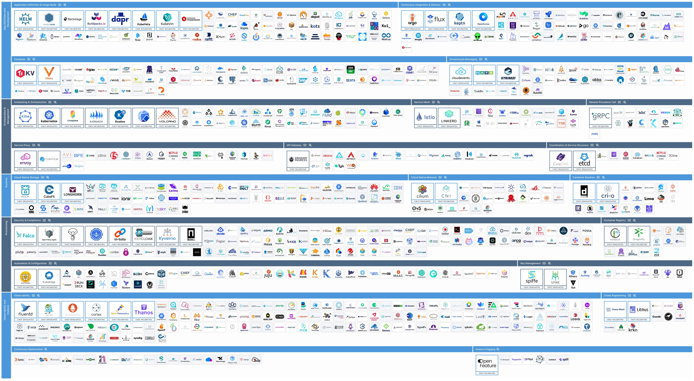

According to Gartner, platform engineering is "a discipline that involves building and managing self-service internal developer platforms to improve developer experience and scale agile and DevOps practices."

Platform Engineering is a tough job that requires you to understand both the infrastructure and services available in your organization as well as how developers want to consume those resources.  You have to balance providing a simple interface for developers to access the resources they want, and promoting practices that make applications naturally operable and easy to scale.

Kuberentes is one path that many organizations leverage to being to provide their own platforms, but Kubernetes is not naturally a platform for developers.  "Kubernetes is a platform for building platforms," according to Kelsey Hightower, one of the most active evangelists of Kubernetes.  So there's an understanding that more must be done on top of Kubernetes to provide a platform that "improves developer experience and scale agile and DevOps practices."

*[Cloud Native Computing Foundation Project Landscape](https://landscape.cncf.io/)*

As a platform engineer, you want to make sure you are using proven technologies for your platform with a healthy ecosystem around them.  The [Cloud Native Computing Foundation](https://cncf.io) hosts Kubernetes and many other projects used to provide a more complete developer experience on top of Kubernetes.  You could sift through the 191 projects to collect solutions for container image builds, contiunous delivery, app services, cluster scheduling, API gateways, security and observability.  But you are under pressure to improve developer experience and delivery now, not 3 years from now.

Tanzu Platform brings together proven technologies to make it easy for platform engineers to deliver a platform with much less toil than trying to assemble your own.  Its also a platform that your developers will love because it automates all the things they don't want to worry about so that they can focus on delivering code rather than trying to figure out Kubernetes manifests.

Let's turn that "platform for building platforms" Kubernetes cluster into a "self-service internal developer platform".