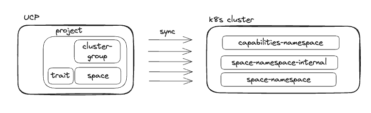

Before the login to Tanzu Platform for Kubernetes, it's important to set the organization ID for the tanzu CLI, which is already done for you in this workshop with the `TANZU_CLI_CLOUD_SERVICES_ORGANIZATION_ID` environment variable.
```execute
echo $TANZU_CLI_CLOUD_SERVICES_ORGANIZATION_ID
```

Once that's done, normally, you would just issue a `tanzu login`, let the CLI open a browser window for you, log in to the Cloud Services Platform (CSP), and your browser would redirect you to a local listener that the Tanzu CLI sets up to accept the token generated for your login.  

However, we're running this workshop in Educates, so we are almost acting as if we've SSH'd into a remote machine that doesn't have a browser.  Luckily, the Tanzu CLI Github repo has some [instructions](https://github.com/vmware-tanzu/tanzu-cli/blob/main/docs/quickstart/quickstart.md#interactive-login) on how to deal with this situation.  We're going to follow the procedure for manually copying the token from your browser tab and pasting it into the Educates terminal where we're logging in from.  You can see an example of where the token will appear in your browser when it fails to connect to the local listener port (which is running in a pod on the cluster Educates is running on) in the following image:


Click on the section below to log in. Your browser will prompt you to log in to the CSP, and then it will show an error page since your machine can't talk directly to the Tanzu CLI running in Educates. Copy the token from the address bar and then come back to Educates.


You will see an error page pop up when the `tanzu login` command runs. This is normal in the workshop environment.  Follow the instructions and image right above the `tanzu login` step in the workshop instructions that explains how to copy the `code` value from the error page address bar, and then paste that code value into this terminal session


```execute
tanzu login
```

Now, in the terminal session that we ran the login command in, paste your copied token, and press enter.

### tanzu CLI & UCP
The tanzu CLI and the plugins we use interact with the **Tanzu Platform Unified Control Plane (UCP)** via a Kubernetes-style API. The UCP is based on the [kcp](https://github.com/kcp-dev/kcp) open-source project, which is a Kubernetes-like control plane.

The tanzu CLI stores the KUBECONFIG file and context information to interact with the UCP in `~/.config/tanzu/kube/config`. When we run the sub-commands of the project, space and clustergroup plugins, we adjust the context to point to the right level of the hierarchy of resources in UCP:
```
Organization
|
 -- Projects
    |
     -- Spaces / Cluster Groups
```

Let's check this by setting a Project and a Space.
```execute
tanzu context current | grep -E "Kube Context"
```

```execute
tanzu project use 
tanzu context current | grep -E "Kube Context"
```

More on this in the [documentation](https://docs.vmware.com/en/VMware-Tanzu-Platform/services/create-manage-apps-tanzu-platform-k8s/how-to-create-and-manage-cli-contexts.html)

During this workshop, we will also use `kubectl` to access some UCP resources. To be able to do that you can set your `KUBECONFIG` environment variable to point to the `~/.config/tanzu/kube/config` file. 
You can also create an alias to only use that `KUBECONFIG` when you need to check UCP resources and leave the default KUBECONFIG (`~/.kube/config`) for regular use of kubectl to access the k8s clusters.
```
alias tk='KUBECONFIG=~/.config/tanzu/kube/config kubectl'
```

Throughout this workshop, you will experience how resources are created at the UCP level and automatically copied over to and kept in sync with the Kubernetes workload clusters. At a high level:
