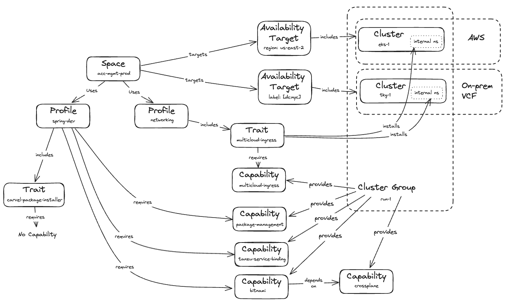

As a platform engineer, we need to be able to configure the platform and prepare repeatable and configurable environments for the application team to deploy applications into - which are called **Spaces**. 

Spaces take the **Kubernetes namespace concept** that ensures boundaries such as permissions and networking discoverability and **make it much more powerful**!
They become a way to control which APIs are available to users, where applications are deployed and their level of availability, and a way to guarantee consistent usage of platform-provided Capabilities.

There are several additional concepts platform engineers need to get familiar with:
- **Cluster Groups** are groups of Kubernetes clusters with the same capabilities. The capabilities of a Cluster Group are curated by the platform engineers. This enables them to control the types of workloads that can be installed on different clusters.
- **Capabilities** describe the APIs and features available from the platform. To curate the APIs that are available to users, platform engineers install ** (Carvel) packages on clusters**. These packages provide APIs or custom resource definitions (CRDs) and their respective controllers on the cluster, which enables functionality on them.
*Spaces* by default do not have access to any of those *Capabilities* on the platform. To make the *Capabilities* available to a *Space*, a *Space* author must require *Capabilities*. 
A *Space* will be scheduled on a cluster only if that cluster provides all of the *Capabilities* that the *Space* requires.
- **Availability Targets** are groups of Kubernetes clusters that allow users to define where a *Space* schedules its applications.
- **Profiles** are groups of required *Capabilities* that are intended to be reusable building blocks for defining characteristics of *Spaces*. 
- **Traits** are collections of Kubernetes resources that are **deployed into *Spaces*** when they are created. They deliver required, pre-configured, and consistent content to them.

Here's a conceptual diagram of how these relate to each other:

More on this in the [Tanzu Application Engine Conceptual Overview documentation](https://docs.vmware.com/en/VMware-Tanzu-Platform/services/create-manage-apps-tanzu-platform-k8s/concepts-about-spaces.html)