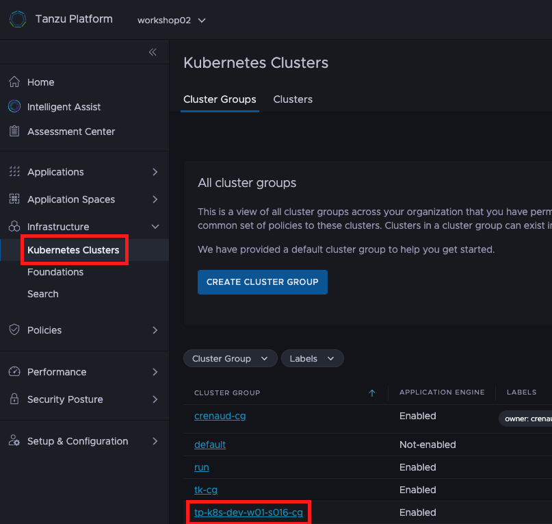
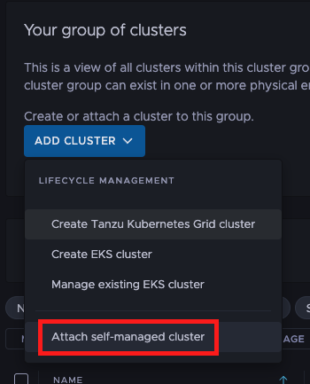
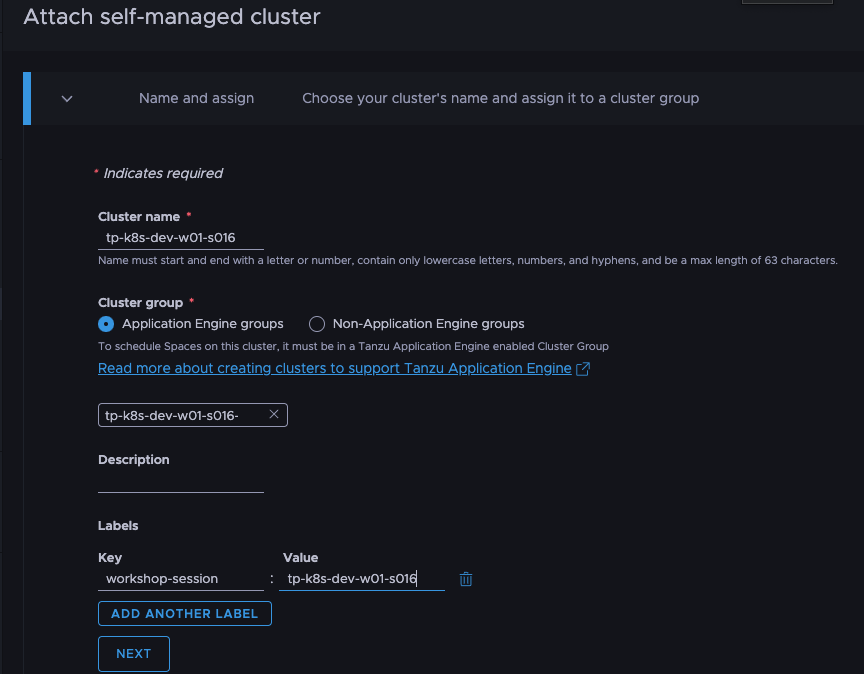
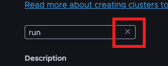
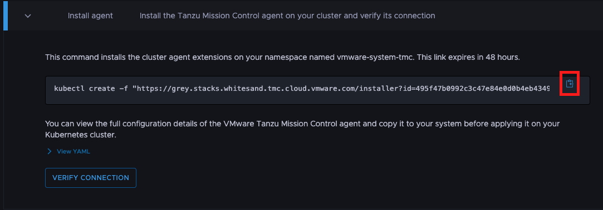
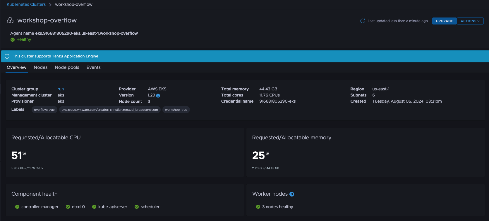

Tanzu Platform for Kubernetes currently provides **full lifecycle management** and support for 
- Tanzu Kubernetes Grid Service clusters running in vSphere with Tanzu
- AWS EKS clusters
The documentation is available [here](https://docs.vmware.com/en/VMware-Tanzu-Platform/services/create-manage-apps-tanzu-platform-k8s/how-to-create-clusters.html)

Other Kubernetes distributions are not supported for **full lifecycle management** yet, but that doesn't mean that Tanzu Platform for Kubernetes can't work with them.

**For this workshop, we will use a [virtual Kubernetes cluster](https://www.vcluster.com/) that is already provisioned for you.**
å
```execute
kubectl get nodes
kubectl get pods -A
```

As this cluster is not lifecycle managed by Tanzu Platform for Kubernetes, we will attach it as a self-managed cluster.

### Attach workload cluster 
#### Option 1: Tanzu Platform GUI

In the Tanzu Platform GUI navigate to `Infrastructure > Kubernetes Clusters` and select your "-cg" *Cluster Group* by clicking on its name. 


In the resulting screen, click on the **Add Cluster** button, and select the **Attach self-managed cluster** option.


Click the section below to copy the **workshop session name**.
```copy

```
Paste that value as the value for the **Cluster Name** field.

In the **Cluster Group** section of the screen, make sure that the radio button to the left of the "Application Engine groups" label is selected.

Click the section below to copy the name of the cluster group we created earlier
```copy
-cg
```


Click the **X** button in the box above the "Description" label to deselect the **Run** cluster group, which is selected by default.  Paste the value just copied into the clipboard into the box we just cleared to select the cluster group we created earlier in the workshop.

Add a **label** with the key set to **workshop-session** and value set to ****. This label will be important for the configuration of the `Availability Target`.  Click the **Next** button to continue.


Now, click the clipboard icon next to the install command.  Paste this command into the workshop's upper terminal session and press **Enter** to install the cluster agent extensions in the workload cluster.

To verify whether the cluster is successfully onboarded to Tanzu Platform for Kubernetes, you can switch back to Tanzu Platform GUI, click on the **Verify connection** button.  If the cluster doesn't verify when you first click the button, give it a little more time, and then click the button again.  You will need to have a successful verification to proceed.


Once your cluster is verified, you can click on the now enabled "View Your Cluster" button to see your attached cluster.

#### Option 2: tanzu CLI
```section:begin
title: "Open instructions"
```
To attach our workload cluster to Tanzu Platform for Kubernetes via the tanzu CLI, we first have to create a template file with the required configuration.
```editor:append-lines-to-file
file: ~/cluster-attach-values.yaml
description: Add template file for cluster attachment
text: |
  fullName:
    managementClusterName: attached
    provisionerName: attached
    name: 
  meta:
    description: Attaching cluster using tanzu cli
    labels:
      workshop-session: 
  spec:
    clusterGroupName: -cg
```
As you can see, we are setting the name of cluster like for the `Cluster Group` to our workshop session. We also add a **label** with the key "workshop-session" and the workshop session name as a value. This label will be important for the configuration of the `Availability Target`.

The following command will, based on the configuration in the template file, attach our workload cluster to Tanzu Platform for Kubernetes by installing cluster agent extensions into it.
```execute
tanzu operations cluster attach --file cluster-attach-values.yaml --kubeconfig .kube/config --skip-verify
```

To verify whether the cluster is successfully onboarded to Tanzu Platform for Kubernetes, you can run the following command (or use to Tanzu Platform GUI).
```execute
tanzu operations cluster get  --cluster-type attached
```


It could take some time until the workload cluster is successfully onboarded. Just rerun the `tanzu operations cluster get` command until this is the case.


```section:end
```

### Check whether Capabilities defined in Cluster Group are provided by the Cluster
You can run the following command to get all `PackageInstalls`, which is the underlying way of installing *Capabilities*.
```execute
kubectl get packageinstalls.packaging.carvel.dev -A
```


It could take some time until the `PackageInstalls` are synced to the cluster and reconciled. Just rerun the command until this is the case.


For the `PackageInstall` of our **Container App** *Capability*, the description should be `Reconcile succeeded` if it was successfully installed.
```execute
kubectl get packageinstalls.packaging.carvel.dev container-apps.tanzu.vmware.com -n tanzu-cluster-group-system
```

With the [kapp CLI](https://carvel.dev/kapp/), we can easily see which Kubernetes resources the package has installed on our cluster.
```execute
kapp inspect -a container-apps.tanzu.vmware.com.app -n tanzu-cluster-group-system
```
