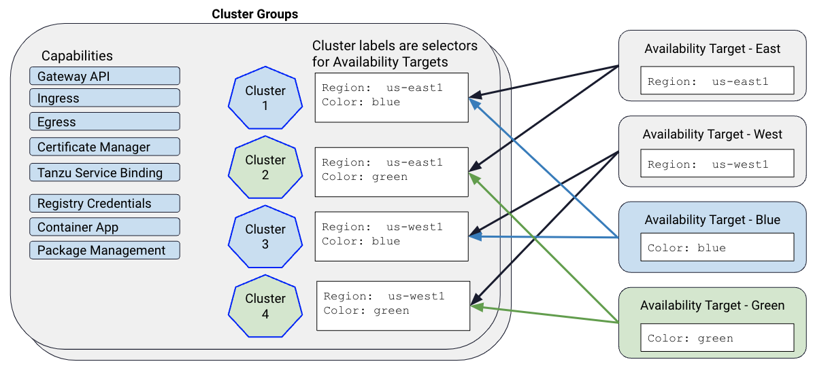
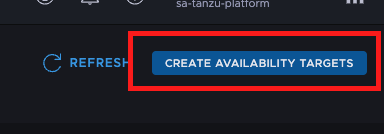
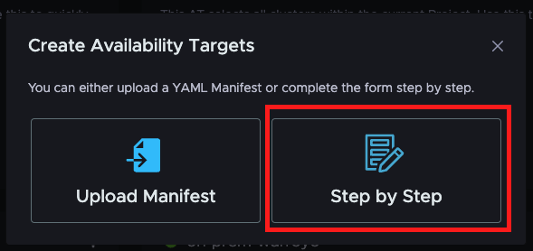
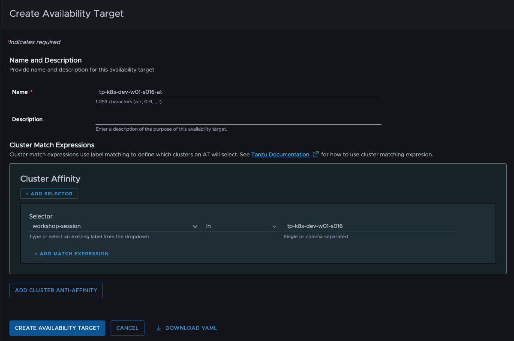
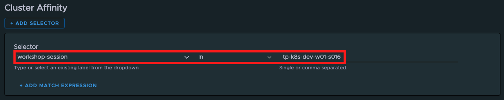
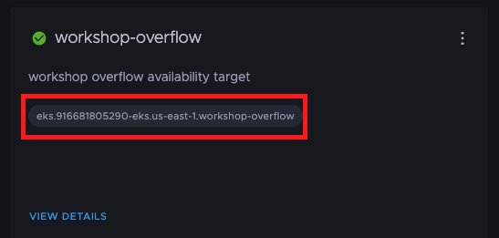

Earlier in the workshop, we created a *Cluster Group* and specified the *Capabilities* to be installed for any clusters we have in it. *Cluster Groups* are great for standardizing what gets installed in your clusters, and you might just have one or two of those in your organization. However, you might want to control where apps get scheduled based on regions, data sovereignty laws, or lifecycle stages. This is where *Availability Targets* can be very useful.



### Cluster Matching
*Availability Targets* allow you to define what clusters should be part of the target by **specifying rules on labels**.
Those rules can be defined via "Cluster Affinity" and "Cluster Anti-affinity" expressions.


"Cluster Affinity" expressions are evaluated first to determine the list of clusters that should be "selected in" to the *Availability Target*.  We can specify a label to examine in the first text field for the selector.  Next, we can specify an operator to apply to that label. Using the "In" operator, we can check to see if the label contains a certain value or a value from a comma-separated list of values.  We can use the "Not In" operator to select clusters that have the label, but the value for that label isn't contained in the given list of values (or single value).  We can also simply check to see if the label "Exists" for the cluster, or if it "Does Not Exist" on that cluster.

By clicking the "Add Match Expression" button, we can add additional criteria that are "AND"-ed to the first criteria we specify. By clicking the "+ Add Selector" button, we can add criteria that are "OR"-ed to the other selectors in our Cluster Affinity definition.

Once the rules for selecting clusters into the *Availability Target* are defined, we can use the "Add Anti-Affinity" button to add criteria that are used to "de-select" clusters based on labels on the clusters that were previously selected. Cluster Anti-Affinity rules are managed similarly to the Cluster Affinity rules, but the result is that they remove clusters that were previously selected for the *Availability Target*.

### Create Availability Target

Let's create an *Availability Target* that selects just your cluster.

#### Option 1: Tanzu Platform GUI
In the Tanzu Platform GUI navigate to `Application Spaces > Availability Targets`.

Next, click on the button in the upper right corner of the browser window labeled "Create Availability Targets".


In the resulting dialog, click the "Step by Step" button to get the guided interface for creating the *Availability Target*.



Now, let's name our *Availability Target* based on the session name.  Click on the section below.
```copy
-at
```
Paste the copied value the **Name** field of the **Create Availability Target** screen.

Remember back when we attached our cluster, we added a label to it with the key of **workshop-session**. We're going to use that label for the "Cluster Affinity" selector for our *Availability Target*. Copy the value below into your clipboard by clicking the box below:
```copy
workshop-session
```


Next, in the selector section of the *Availability Target* screen, paste the value we just copied into the first text field under the "Selector" subheading of the "Cluster Affinity" section of the screen.

Make sure the middle dropdown list for the expression is set to "In" for the operator, and change it to "In" if it is not.

Now, copy the name of your workshop session by clicking the box below: 
```copy

```

Paste your workshop name into the final text box for the Cluster Affinity expression.

Finally, click **Create Availability Target** button.


To validate the *Availability Target* is ready and has selected our cluster, navigate to `Application Spaces > Availability Targets` section from the left hand menu

Click the section below to copy your availability target name.
```copy
-at
```

Paste the copied value into the **Search** text box at the top of the screen to find your *Availability Target*.  You should see a tile that represents your *Availability Target*, and it should contain a single lozenge inside with the name of your attached cluster, ****.  If you see no lozenge, multiple lozenges, or a lozenge that doesn't match your attached cluster name, go back to your availability target and edit to to verify the affinity rule is set properly.

#### Option 2: tanzu CLI (or kubectl) CLI
```section:begin
title: "Open instructions"
name: tanzu-cli
```

To create an *Availability Target* with the tanzu CLI, we have to first create a resource file with all the configurations.
```editor:append-lines-to-file
file: ~/availability-target.yaml
description: Add availability target resource file
text: |
  apiVersion: spaces.tanzu.vmware.com/v1alpha1
  kind: AvailabilityTarget
  metadata:
    name: -at
    namespace: default
  spec:
    affinity:
        clusterAffinity:
          clusterSelectorTerms:
          - matchExpressions:
              - key: workshop-session
                operator: In
                values:
                    - 
```
As you can see, the name of the *Availability Target* is based on the workshop session.

Remember back when we **attached our cluster, we added a label to it with the key of "workshop-session"**. We use that label for the "Cluster Affinity" selector for our *Availability Target*.

Finally, we can create the *Availability Target*.
```execute
tanzu project use $TANZU_PLATFORM_PROJECT
tanzu availability-target create -f availability-target.yaml -y
```

Checking whether the *Availability Target* is in `Ready` state and your cluster is listed is also possible with the tanzu CLI.
```execute
tanzu availability-target get -at
```


It could take some time until the *Availability Target* is in `Ready` state. Just rerun the command until this is the case.


##### kubectl CLI
```section:begin
title: "Open instructions"
name: kubectl-cli
```
The resource file we created is in the form of a custom Kubernetes resource definition, which means that we can alternatively also directly manage (create, delete, edit) the *Availability Target* with kubectl.
```
export KUBECONFIG=~/.config/tanzu/kube/config
kubectl apply -f availability-target.yaml
kubectl get availabilitytargets.spaces.tanzu.vmware.com  -o yaml
unset KUBECONFIG  
```
```section:end
name: kubectl-cli
```
```section:end
name: tanzu-cli
```

Great! We now have a way for our developers to reference our available clusters that isn't tied to a specific cluster instance. This de-couples our app teams from our currently deployed clusters in a way that gives our team the ability to add and remove clusters without having to have our developers change any of their configurations.

Realize, this is a very limited example of how *Availability Targets* can be used to simplify the workshop. In real deployments, an *Availability Target* will likely select multiple clusters. Then, the platform can use any of the healthy clusters in a set of multiple *Availability Targets* to schedule applications.