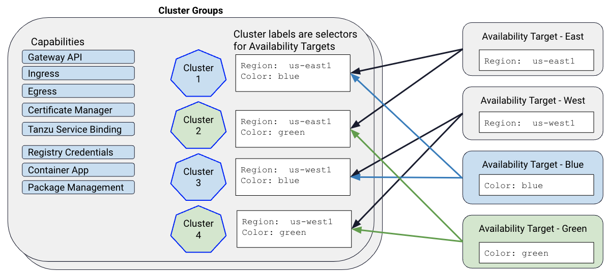
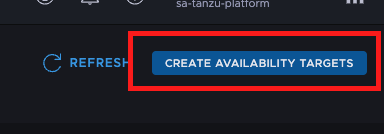
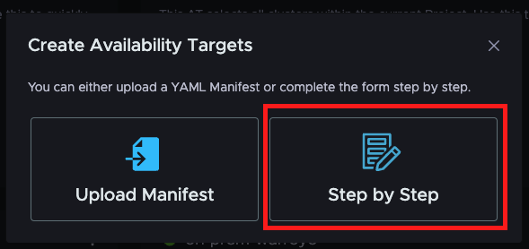
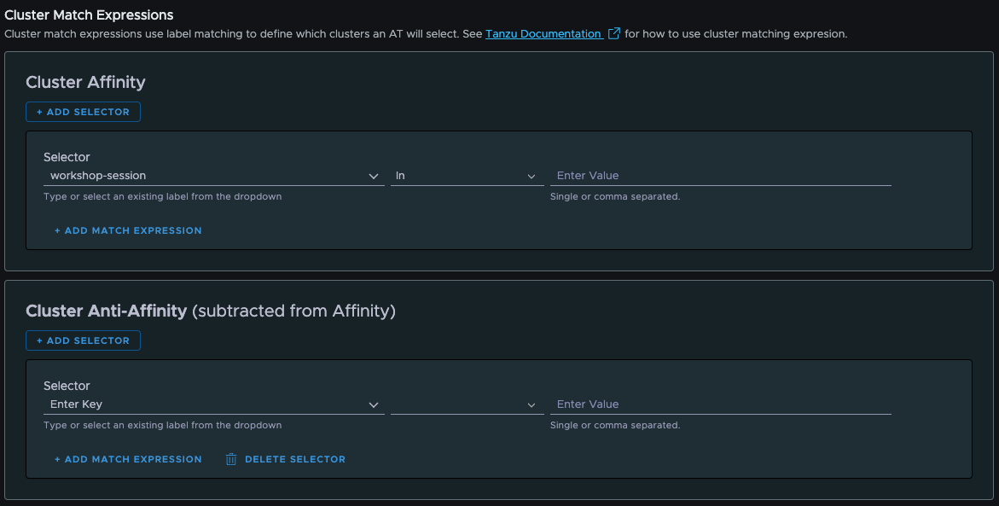

Now we've put a cluster under management and that caused our standard set of capabilities (software packages and configuration) to be installed, but we now need to set up some resources for developers and DevOps teams to be able to schedule their applications on this cluster.

## Availability Targets


Earlier in the workshop, we created a cluster group, and specified the capabilities to be installed for any clusters we have in that group.  Cluster Groups are great for standardizing what gets installed to your clusters, and you might just have one or two of those in your organization.  However, you might want to control where apps get scheduled based on regions, or data sovereignty laws, or lifecycle stage.  This is where **Availability Targets** can be very useful.

Availability Targets allow you define what clusters should be part of the target by specifing rules on tags.  You can then name the Availability Targets using language that makes sense to DevOps and devlopers.

Let's create an Availability Target that selects just your cluster. In our workshop environment, we have multiple attendees attaching their own clusters, and we want to make sure our app lands on the cluster we specifically attached.  So let's name our Availability Target the same as the unique session name of our session.

First, copy your session name by clicking on the section below:
```copy

```

Next, navigate to the Tanzu Platform interface for managing Availability Targets by going to https://www.mgmt.cloud.vmware.com/hub/application-engine/availability-targets.



Next, click on the button in the upper right corner of the browser window labeled "Create Availability Targets."



In the resulting dialog, click the "Step by Step" button to get the guided interface for creating the availability target.

Now, let's name our availability target the same as our session name by pasting the clipboard into the "Name" field.

### Cluster Matching

Next we need to define the rules for how our Availability Target will select which clusters need to be a part of it.  We do that by defining "Cluster Affinity" and "Cluster Anti-affinity" expressions that select or reject clusters from the Availability Target.

"Cluster Affinity" expressions are evaluated first to determine the list of clusters that should be "selected in" to the Availability Target.  We can specify a label to examine in the first text field for the selector.  Next, we can specify an operator to apply to that label.  Using the "In" operator, we can check to see if the label contains a certain value, or a value from a comma separated list of values.  We can use the "Not In" operator to select clusters that have the label, but the value for that label isn't contained in the given list of values (or single value).  We can also simply check to see if the label "Exists" for the cluster, or if it "Does Not Exist" on that cluster.

By clicking the "Add Match Expression" button, we can add additional criteria that are "AND"-ed to the first criteria we specify.  By clicking the "+ Add Selector" button, we can add criteria that are "OR"-ed to the other selectors in our Cluster Affinity definition.

Once the rules for selecting clusters in to the Availability Target are defined, we can use the "Add Anti-Affinity" button to add critera that are used to "de-select" clusters based on labels on the clusters that were previously selected.  Cluster Anti-Affinity rules are managed similarly to the Cluster Affinity rules, but the end result is that they remove clusters that were previously selected for the Availability Target.

Remember back when we attached our cluster, we added a label to it with the key of **workshop-session**.  We're going to use that label for the "Cluster Affinity" selector for our Availability Target.

Copy the value below into your clipboard by clicking the box below:
```copy
workshop-session
```

Next, in the selector section of the Availability Target screen, paste the value we just copied into the first text field under the "Selector" subheading of the "Cluster Affinity" section of the screen.

Make sure the middle dropdown list for the expression is set to "In" for the operator, and change it to "In" if it is not.

Now, copy the name of your workshop session by clicking the box below: 
```copy

```

Paste your workshop name into the final text box for the Cluster Affinity expression.

Finally, click "Create Availability Target" button.

***TODO:*** Validate the Availability Target selected our cluster.

Great!  We now have a way for our developers to reference our available clusters that isn't tied to a specific cluster instance.  This de-couples our app teams from our currently deployed clusters in a way that gives our team the ability to add and remove clusters without having to have our developers change any of their configuration.

Realize, this is a very limited example of how Availability Targets can be used to simplify the workshop.  In real deployments, an Availability Target will likely select multiple clusters.  Then platform can use any of the healthy clusters in a set of multiple Availability Targets to schedule applications.

## Create Profile
***TODO:*** Create a new, simple profile that requires just the minimum needed to run a simple app.  Networking will be pre-configured and supplied separately.

## Create Space
***TODO:*** Create a Space selecting our custom profile, but using a provided networking profile.

## Deploy a Sample App
***TODO:*** Deploy an application that is "pre-built" to the platform so that you can see a running app launch and access it via Ingress.
