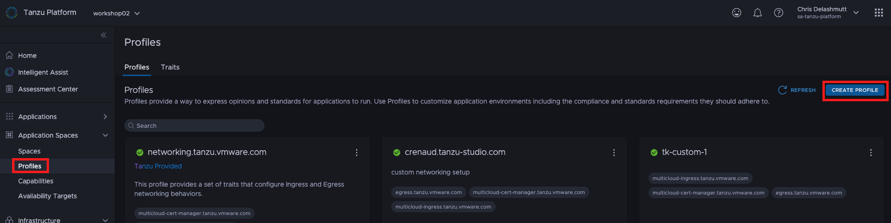
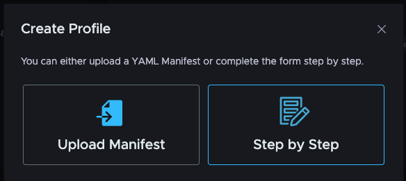
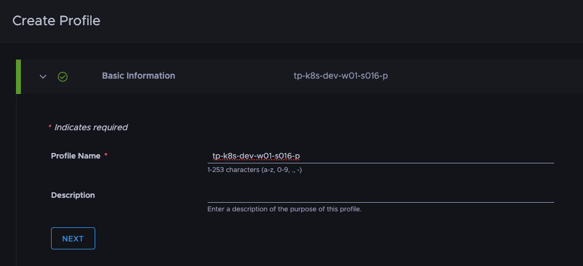
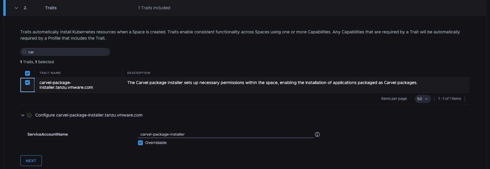
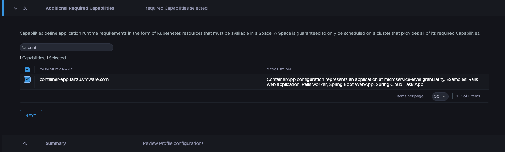
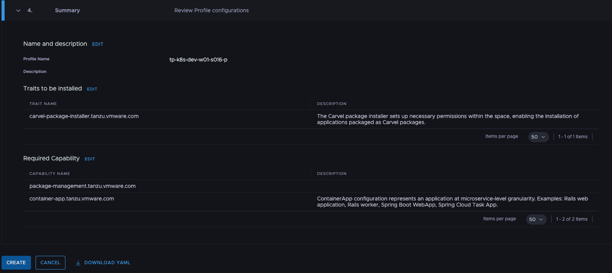

For the successful scheduling of the applications onto clusters, it's not only necessary to define a target group of clusters with an *Availability Target*, you also have to define the required *Capabilities* for your application which the target clusters have to provide. 
More information on how the scheduling works is available [here](https://docs.vmware.com/en/VMware-Tanzu-Platform/services/create-manage-apps-tanzu-platform-k8s/concepts-about-spaces.html#space-scheduling-4).

***Profiles* are reusable building blocks for defining application environment characteristics or in other words required *Capabilities* and *Traits*.** 
*Profiles* are intended to be reused across *Spaces*. Tanzu Platform for Kubernetes provides for example ootb a "spring-prod.tanzu.vmware.com" *Profile* as a reusable way to create environments for running Spring applications in production. 

### Create a custom Profile

Let's create a *Profile* for our minimal workshop example.

#### Option 1: Tanzu Platform GUI

In the Tanzu Platform GUI click on the `Application Spaces > Profiles` navigation menu. Then, click on the button in the upper right corner of the browser window labeled "Create Profile".


In the resulting dialog, click the "Step by Step" button to get the guided interface for creating the *Profile*.


Now, let's name our *Profile* based on our session name.  Click the section below to copy the value into your clipboard.
```copy
-p
```
Paste this value into the **Profile Name** field.  Then click the **Next** button.


In this section, we want to select the  **carvel-package-installer.tanzu.vmware.com** trait, which is required to deploy an application as a [kapp-controller Package](https://carvel.dev/kapp-controller/docs/v0.50.x/packaging/#overview) - the default for Tanzu Application Platform.  Enter "car" into the search box to filter the list down to the Carvel Package Installer trait that we want to select for our profile.  Click the checkbox next to that trait to select it.

As a reminder, *Traits* are collections of Kubernetes resources that are deployed into *Spaces* when they are created and usually rely on `Capabilities` available in the cluster. 

You can configure the *Trait* by clicking on the **"Configure carvel-package-installer.tanzu.vmware.com"** button. In this case the default value for the "ServiceAccountName" is fine, so leave it at defaults.  Different traits will have trait-specific options that could configure specific to your needs.

Click the **Next** button to continue.


Traits you select in the previous section will automatically select any required Capabilities they need to function for your profile.  However, you can add additional Capabilities if needed.

Enter "cont" into the search box and click the checkbox next to the **container-app.tanzu.vmware.com** capabilty.

Then, enter "pa" into the search box, and click the checkbox next to the **package-management.tanzu.vmware.com** capability.  Click the **Next** button to continue.


You should now see the summary page and review your settings.  Make sure the name, traits and required capabilties match what we selected above.  Now, click on the **Create** button to create our new profile.

You can check whether the *Profile* is ready by navigating to `Application Spaces > Profiles`, searching for your *Profile* in the list and clicking on the "View Details" button.

#### Option 2: tanzu CLI (or kubectl) CLI
```section:begin
title: "Open instructions"
name: tanzu-cli
```

To create a *Profile* with the tanzu CLI, we have to create a resource file with all the configurations like for the *Availability Target*.
```editor:append-lines-to-file
file: ~/profile.yaml
description: Add profile resource file
text: |
  apiVersion: spaces.tanzu.vmware.com/v1alpha1
  kind: Profile
  metadata:
    name: -p
    namespace: default
  spec:
    requiredCapabilities:
      - name: container-app.tanzu.vmware.com
      - name: package-management.tanzu.vmware.com
    traits:
      - values:
          inline:
            carvel-package-installer:
              serviceAccountName: carvel-package-installer
        excludedKeys: []
        name: carvel-package-installer.tanzu.vmware.com
```
As you can see, the name of the *Profile* is again based on the workshop session.

The only defined required *Capabilities* are **Container App** and **Package Management**. The **Container App** *Capability* is the only one we added to our cluster group. The **Package Management** *Capability* was automatically installed on the cluster when we attached it. To be able to use the APIs of those *Capabilities* in a *Space* it's important to define them in the *Profile*. Otherwise, it's for example not possible to add a Carvel Package resource for an application to the *Space* even if those CRDs are installed on the target cluster.

In addition, there is the **Carvel package installer *Trait*** configured, which is required to deploy an application as a [kapp-controller Package](https://carvel.dev/kapp-controller/docs/v0.50.x/packaging/#overview) - the default for Tanzu Application Platform.

As a reminder, *Traits* are collections of Kubernetes resources that are deployed into *Spaces* when they are created and usually rely on `Capabilities` available in the cluster. 

Finally, we can create the *Profile*.
```execute
tanzu project use 
tanzu profile create -f profile.yaml -y
```

Checking whether the *Profile* is ready is also possible with the tanzu CLI.
```execute
tanzu profile get -p
```

##### kubectl CLI
```section:begin
title: "Open instructions"
name: kubectl-cli
```
The resource file we created is in the form of a custom Kubernetes resource definition, which means that we can alternatively also directly manage (create, delete, edit) the *Profile* with kubectl.
```
export KUBECONFIG=~/.config/tanzu/kube/config
kubectl apply -f profile.yaml
kubectl get profiles.spaces.tanzu.vmware.com -p -o yaml
unset KUBECONFIG  
```
```section:end
name: kubectl-cli
```
```section:end
name: tanzu-cli
```