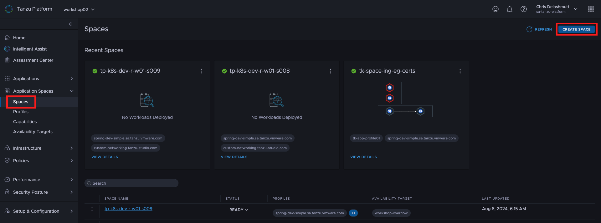
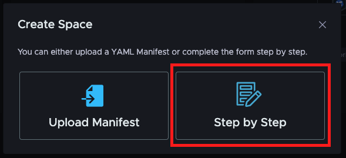
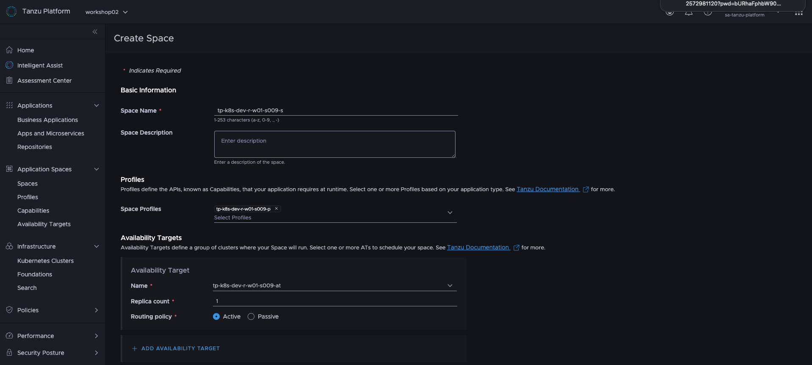
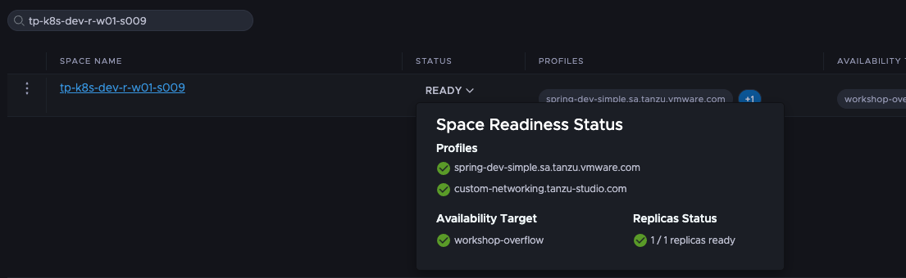

Finally, everything is set up to create a `Space` for the application team. 

### Create a Space
[Official documentation](https://docs.vmware.com/en/VMware-Tanzu-Platform/services/create-manage-apps-tanzu-platform-k8s/getting-started-create-app-envmt.html#create-a-space-in-your-project-4)

#### Option 1: Tanzu Platform GUI

In the Tanzu Platform GUI navigate to `Application Spaces > Spaces` or click [here](https://www.mgmt.cloud.vmware.com/hub/application-engine/spaces).  Next, click on the button in the upper right corner of the browser window labeled **Create Space**.


In the resulting dialog, click the "Step by Step" button to get the guided interface for creating the space.


Click the section below to copy the value for the space name to your clipboard.
```copy
-s
```
Paste the into the **Space Name** field.

Click the section below to copy the value for your profile name into your clipboard.
```copy
-p
```
Paste this value into the **Space Profiles** field, and mark the checkbox next to the profile name you created earlier.

Click the section below to copy the value for your availability target into your clipboard.
```copy

```
Paste this value into the Availability Target **Name** field.  

Notice that the **Replica count** field is set to 1, which is the default.  This means that the applications in the space will be deployed to one of the clusters that match the *Availability Target's* rules. Leave this value at its default.  

Notice also tshat the **Routing Policy** is set to active, by default.  This means that ingress IPs to routes to all the replicas of that space scheduled on clusters in the specified availability target will be added to any GLSB configured as an "active" route.  DNS requests for the the FQDN for apps in the space will return the this ingress IP.  If there are multiple active replicas of the space that are marked with an "active" routing policy will result in a round-robin, assuming that the health checks for the app are passing.  If you select "passive", then ingress IPs for any routes in space replicas on the availability target will only be returned if all the "active" space replicas are not available per their healthchecks.

If you expand the **Advanced Configuration** section, you will see some options for specifing CPU and Memory limits for the space (per replica), and the space update strategy.  We are only using 1 replica for our space, so there is no difference in the rollout strategy.  RollingUpdate means that one replica would be deleted and recreated at a time when changes are needed.  Recreate means that all replicas are deleted and recreated at the same time.

Now, create the *Space* by clicking on the **Create Space** button.

Click the section below to copy the value for the space name to your clipboard.
```copy
-s
```
Paste the into the **Search** field above the spaces list in the middle of the page.


In the list, you can see the status of your space.  If you click on the status, you can see additional details about the status of your space.  It may take a few seconds for the space to go from `ERROR` (red), through `WARNING` (yellow), to `READY` (green) state. Click on the top-right `Refresh` link to update.  Your space needs to be in the `READY` state before continuing on.

#### Option 2: tanzu CLI
```section:begin
title: "Open instructions"
```

It's possible to create a *Space* with the tanzu CLI, but unfortunately, the related CLI plugin doesn't work very well for it yet.
```execute
tanzu space create --help
```

So, let's again create a resource file with all the configurations.
```editor:append-lines-to-file
file: ~/space.yaml
description: Add space resource file
text: |
  apiVersion: spaces.tanzu.vmware.com/v1alpha1
  kind: Space
  metadata:
    name: -s
    namespace: default
  spec:
    availabilityTargets:
    - name: -at
      replicas: 1
    template:
      spec:
        profiles:
        - name: -p
          values:
            inline: null
    updateStrategy:
      type: RollingUpdate
```
As you can see, we also use the session name as a name for our *Space* and specify our *Profile* and *Availability Target*.

For the *Availability Target*, the **"Replica(s)" is set to 1**, which is the default and means that the applications in the space will be deployed to one of the clusters matching the *Availability Target's* rules. As we only have one cluster available, you cannot increase it to deploy the application on multiple clusters for high availability. 

You can also configure the update strategy. Rolling update is the default and fine for this workshop.

You can then create the *Space* with the following command.
```execute
tanzu project use $TANZU_PLATFORM_PROJECT
tanzu deploy --only space.yaml -y
```

We can also check whether the *Space* is ready with the tanzu CLI. It may take some time, and the space can also be in warning or error state for some time.
```execute
tanzu space get -s
```
```section:end
```

#### Option 3: kubectl CLI
```section:begin
title: "Open instructions"
```

The resource file we created is in the form of a custom Kubernetes resource definition, which means that we can alternatively also directly manage (create, delete, edit) the *Space* with kubectl.
```
export KUBECONFIG=~/.config/tanzu/kube/config
kubectl apply -f space.yaml
kubectl get spaces.spaces.tanzu.vmware.com -s -o yaml
unset KUBECONFIG  
```
```section:end
```
### Check resources created in the workload cluster
After the *Space* is ready, we can check what was applied for it on our workload cluster.

If you have a look at the Kubernetes namespaces, you should be able to see two namespaces that were created for our *Space*.
```execute
kubectl get ns
```

In the namespaces with the "-internal" suffix the `PackageInstalls` for the *Traits* will be applied, the other namespace is for all the resources running in the *Space*.
```execute
SPACE_NS_INTERNAL=$(kubectl get namespaces -o json | jq -r '.items[].metadata.name | select(endswith("-internal"))')
kubectl get pkgi -n $SPACE_NS_INTERNAL
```
In our case, there should be a `PackageInstall`for the "Carvel package installer" *Trait*.

With the kapp CLI, you can see which resources it has created in the *Space* namespace without the suffix.

```execute
APP_NAME=$(kapp list -n $SPACE_NS_INTERNAL --json | jq -r '.Tables[0].Rows[0].name')
kapp inspect -a $APP_NAME -n $SPACE_NS_INTERNAL
```

After you've created the *Space*, it's now time to deploy an example application to it to check whether everything works as expected.